# Priority Labeler Workflow Diagram

This diagram shows the flow of the `prioritize-by-reactions.yaml` GitHub Action workflow.

```mermaid
flowchart TD
    A[Start: GitHub Action Triggered] --> B[Checkout Repository]
    B --> C[Install jq Tool]
    C --> D[Get List of Open Issues]
    
    D --> E{For Each Issue}
    E --> F[🔍 Check Issue #X]
    
    F --> G[Get Issue Labels]
    G --> H[Get Issue Reactions]
    H --> I[Count Total Reactions]
    
    I --> J{Has Type:Bug Label?}
    J -->|Yes| K[🐛 Bug Detected]
    J -->|No| L{Has Type:Feature Label?}
    
    K --> M{Reactions ≥ 10?}
    M -->|Yes| N[Set Priority:0]
    M -->|No| O{Reactions ≥ 5?}
    O -->|Yes| P[Set Priority:1]
    O -->|No| Q[Set Priority:2]
    
    L -->|Yes| R[✨ Feature Detected]
    L -->|No| S[👉 Skip: No Type Label]
    
    R --> T{Reactions ≥ 25?}
    T -->|Yes| U[Set Priority:1]
    T -->|No| V[Set Priority:2]
    
    N --> W[Get Current Priority Label]
    P --> W
    Q --> W
    U --> W
    V --> W
    
    W --> X{Priority Changed?}
    X -->|No| Y[✅ Priority Already Correct]
    X -->|Yes| Z{Has Existing Priority?}
    
    Z -->|No| AA[➕ Add New Priority Label]
    Z -->|Yes| BB[Check Who Set Current Label]
    
    BB --> CC{Set by github-actions?}
    CC -->|No| DD[🚫 Skip: Manual Label]
    CC -->|Yes| EE[⏹️ Remove Old Label]
    
    EE --> AA
    AA --> FF[Continue to Next Issue]
    Y --> FF
    S --> FF
    DD --> FF
    
    FF --> GG{More Issues?}
    GG -->|Yes| E
    GG -->|No| HH[End: All Issues Processed]
    
    style A fill:#e1f5fe
    style HH fill:#e8f5e8
    style K fill:#ffebee
    style R fill:#f3e5f5
    style S fill:#fff3e0
    style DD fill:#fff3e0
```

## Workflow Logic Summary

### Priority Assignment Rules:

**For Bug Issues (`Type:Bug`):**
- 10+ reactions → `Priority:0` (Highest)
- 5-9 reactions → `Priority:1` (Medium)
- 0-4 reactions → `Priority:2` (Low)

**For Feature Requests (`Type:Feature`):**
- 25+ reactions → `Priority:1` (Medium)
- 0-24 reactions → `Priority:2` (Low)

### Safety Features:
- Only processes issues with `Type:Bug` or `Type:Feature` labels
- Only modifies priority labels that were previously set by `github-actions[bot]`
- Preserves manually-set priority labels
- Gracefully handles API errors by skipping problematic issues
