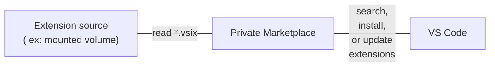
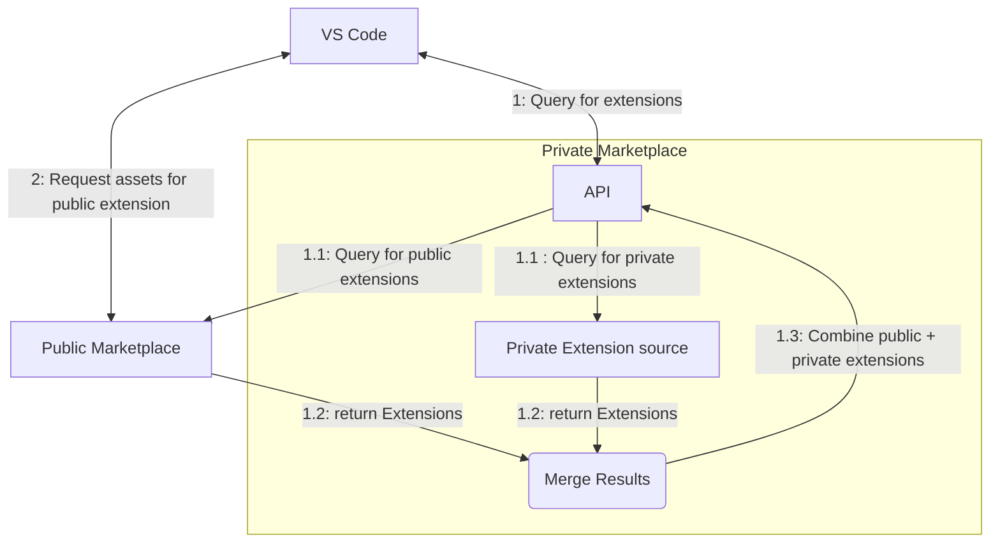

*release version: 1.0.57*

---

Welcome to the **Private Marketplace for Visual Studio Code**!

Private Marketplace enables hosting and distributing extensions on-premises or in private cloud environments, helping you meet your organizational security policies. It seamlessly integrates with the familiar VS Code Extensions experience for easy discovery and auto-updating of private extensions. It enables securing your development environment by serving as a proxy for consuming [public](https://marketplace.visualstudio.com/vscode) extensions. When combined with VS Code's [extension allowlist](https://code.visualstudio.com/docs/setup/enterprise#_configure-allowed-extensions), Private Marketplace helps you enforce organizational policies governing which extensions are installed.

This document will guide you through deploying, configuring, and monitoring your own self-hosted Private Marketplace. You will also learn how to connect VS Code to the Private Marketplace to install extensions.

# Available features
**[Watch the demo▶️](https://aka.ms/privatemktdemo)**

The Private Marketplace ships with these core capabilities:
- **Self-host extensions**: Host internal and downloaded extensions on your own container infrastructure, such as Azure or Kubernetes.
- **Easy deployment**: Deploy the Private Marketplace Docker container (stateless, no external database required).
- **Flexible storage options**: Publish and manage extensions using either a file system directory or Azure Artifacts storage.
- **Upstreaming**: [Optional] Include public extensions automatically from the [Visual Studio Marketplace](https://marketplace.visualstudio.com).
- **Rehosting**: [Optional] Download and host extensions from the Public Visual Studio Marketplace for additional security governance and air-gapped environments.
- **Centralized rollout**: Roll out the Private Marketplace to your team through centralized group policy on Windows, macOS and Linux.
- **Install and automatic updates**: Search and install extensions directly from VS Code. Receive automatic updates for new versions in the Private Marketplace.

# Recommended setup

Choosing the right setup can go a long way in protecting your investment in internal extensions and securing the development environment.

## Convenience
When convenience of hosting internal extensions and ease of use are the primary goals, consider following the 'Non-restrictive' setup below.

## Security governance
Get to know the comprehensive multi-step scanning Microsoft uses to protect VS Code users: [Public marketplace security blog](https://aka.ms/vsmsecurityblog). Understanding the security posture of the Public Marketplace can be highly valuable in making an informed decision about which of the next two setups is right for your organization.

- If your goal is to incrementally add a layer of control over which public extensions are allowed while developers maintain the convenience of accessing the latest public extensions, consider choosing the 'More Restrictive' setup.

 - If you need to meet strict industry regulation or enterprise security policy that goes above and beyond the measures outlined in the [security blog](https://aka.ms/vsmsecurityblog), start with the 'Most Restrictive' setup. This is also the right option for those needing to deploy to an air-gapped or highly firewalled environment.

## Prepare the container and storage
Choose the scenario that best matches your business needs and follow the recommended setup steps. Alternatively, you can sequentially go through the steps below. Private Marketplace is available from Microsoft registry using **docker pull mcr.microsoft.com/vsmarketplace/vscode-private-marketplace:latest**. Private Marketplace ships with Bicep scripts ([download here](https://aka.ms/vspm/scripts)) which make Azure deployment quick and easy by completing the container and storage setup and enabling upstreaming.


|Scenario                                                                                                                                     | Required Steps                                                                                                                                                                                                                                                                                                                                                                                                                                                                                              | Considerations                                                                                                                                                                                                                                                                                                                                                                                                                                                                                                                                                                                                                                                                      |
| --------------------------------------------------------------------------------------------------------------------------------------------------- | ----------------------------------------------------------------------------------------------------------------------------------------------------------------------------------------------------------------------------------------------------------------------------------------------------------------------------------------------------------------------------------------------------------------------------------------------------------------------------------------------------------- | ----------------------------------------------------------------------------------------------------------------------------------------------------------------------------------------------------------------------------------------------------------------------------------------------------------------------------------------------------------------------------------------------------------------------------------------------------------------------------------------------------------------------------------------------------------------------------------------------------------------------------------------------------------------------------------- |
| **Test drive** <br>Explore the basics (non-production)                                                                                                                 | [Run the container locally using Docker](#1-run-the-container-locally-using-docker) on a development machine with VSIX files on the local file system.                                                                                                                                                                                                                                                                                                                                                      | Fastest deployment. Low overhead. Ideal for getting familiar with the app, testing, and debugging the container setup in a lightweight environment. Note that this scenario is intended for learning purposes; connecting from VS Code is not included. For production setup, choose from the scenarios below.                                                                                                                                                                                                                                                                                                                                                                      |
| **Non-restrictive**<br>Self-host internal extensions. Let developers install any Public Marketplace extensions. | (1) Deploy to [Azure Container Apps](#24-deploying-to-azure-container-apps) or [another hosting infrastructure](#21-high-level-deployment-steps), (2) Connect to a [mounted volume](#31-configure-private-extension-source) for VSIX file storage, and (3) Turn on [upstreaming](#32-configure-the-container-to-upstream-extensions-from-the-public-visual-studio-marketplace)*.                                                                                                             | Use this option for the convenience of hosting private extensions plus access to any Public Marketplace extension. Provides a simpler setup process, especially when deployed to Azure Container Apps or Azure Kubernetes using the included Bicep scripts. *Skip step (3) if step (1) was deployed using the included Bicep scripts which already enable upstreaming.                                                                                                                                                                                                      |
| **More restrictive**<br>Self-host internal extensions. Limit what developers can install from the Public Marketplace. | (1) Deploy to [Azure Container Apps](#24-deploying-to-azure-container-apps) or [another hosting infrastructure](#21-high-level-deployment-steps), (2) Connect to a [mounted volume](#31-configure-private-extension-source) for VSIX file storage, (3) Turn on [upstreaming](#32-configure-the-container-to-upstream-extensions-from-the-public-visual-studio-marketplace), and (4) Set up an [allowlist group policy](#33-configuring-allowed-extensions) using VS Code device management. | Provides a simpler setup process, especially when deployed to Azure Container Apps or Azure Kubernetes using the included Bicep scripts. VS Code allowlist provides granular control over which publishers, extensions, and versions are allowed, on Windows, MacOS and Linux. *Skip step (3) if step (1) was deployed using the included Bicep scripts which already enable upstreaming for Search and Assets.|
| **Most restrictive**<br>Rehost a larger number of extensions downloaded from the Public Marketplace.                                                | (1) Deploy to [Azure Container Apps](#24-deploying-to-azure-container-apps) or [another hosting infrastructure](#21-high-level-deployment-steps), (2) Connect to a [mounted volume](#31-configure-private-extension-source) for VSIX file storage, and (3) [Turn off upstreaming](#32-configure-the-container-to-upstream-extensions-from-the-public-visual-studio-marketplace) to prevent duplicates**. | Choose this configuration if VS Code clients must not (for example enterprise security policy) or cannot (for example client machines are air-gapped or firewalled) install extensions from the Public Marketplace. **Disable upstreaming if step (1) was deployed using the included Bicep scripts which enable upstreaming for Search.                                |

<br>

> [!NOTE]
> You may optionally choose [Azure Artifacts storage](#81-using-azure-artifacts-as-extension-storage) for any of the listed scenarios if its feed management UI and fine-grained access control for publishing are more compelling than the simpler deployment of mounted volume storage.

**Custom:** If none of the listed scenarios fit your needs, you can always customize your deployment by sequentially walking through these sections and picking the right options:
- [Deploy the container to your desired container host](#2-deploy-the-container-to-your-desired-container-host)
- [Configure the container to read private extensions](#3-configure-the-container)

## Publish extensions
When the storage is set up and ready to go, [publish your internal or downloaded extensions to the container](#4-publish-extensions-to-the-container).

## Connect from VS Code
By default VS Code points to the Public Marketplace (marketplace.visualstudio.com). You've published extensions to your deployed Private Marketplace. As the next step, [connect VS Code to the Private Marketplace](#5-connect-vs-code-to-the-private-marketplace) to make the private extensions available to your entire team.

## Monitor and debug
If you run into any issues or want to check the health status of your Private Marketplace, check out how to [monitor and debug the running container](#6-monitor-the-running-container).

# 1. Run the container locally using Docker

Before running the application in a cloud or data center, you can run the application locally using Docker. This will help you understand what the app looks like when it is running and what configuration is needed. We'll walk through connecting to the app from VS Code after [deploying to your desired container host](#2-deploy-the-container-to-your-desired-container-host), to avoid issues with SSL setup on the local Docker deployment.

You need to have [Docker installed](https://docs.docker.com/get-started/get-docker/) to perform these steps.

1. Pull the container from the [Microsoft Artifact Registry](https://mcr.microsoft.com/artifact/mar/vsmarketplace/vscode-private-marketplace)
   ```powershell
   # pull the container from the registry so it's available for running
   docker image pull "mcr.microsoft.com/vsmarketplace/vscode-private-marketplace:1.0.57"
   ```

2. Start the container with port 8080 bound to your local machine.
   ```powershell
   # run the container in interactive attached mode, clean up the container after termination
   docker run -it --rm -p 8080:8080 "mcr.microsoft.com/vsmarketplace/vscode-private-marketplace:1.0.57"
   ```

3. Open [http://localhost:8080](http://localhost:8080) in your web browser. You should see a home page with the heading "Welcome to the Private Marketplace for Visual Studio Code".
4. Press Ctrl + C to terminate the Docker process and clean up the container.

Now, let's try loading some extensions into the Private Marketplace.

1. Create a working directory for these steps.
   ```powershell
   mkdir ~/mymarketplace
   cd ~/mymarketplace
   pwd # show the full working directory
   ```

2. Create a text file called `local.env` in the working directory. This will serve as a list of environment variables used by the container.
   ```powershell
   # open the local.env file in VS Code for editing
   code local.env
   ```

   Save the following contents in the file:

   ```env
   Marketplace__ExtensionSourceDirectory=/data/extensions
   Marketplace__Logging__LogToConsole=true
   ```

3. Make a directory for private extensions and print the full path.
   ```powershell
   mkdir extensions
   ```

4. Get a `.vsix` file (VS Code extension file) and put it in the `extensions` directory. This could be one of your team's existing private extensions. Or, you can use VS Code to [download an extension from the Public Marketplace](https://code.visualstudio.com/docs/editor/extension-marketplace#_can-i-download-an-extension-directly-from-the-marketplace).

   There should be at least one `*.vsix` file in the `extensions` directory at the end of this step.
5. Start the container again with the environment variables and a mounted volume. Make sure to update the `</path/to>` in the next command to be the full path printed by `pwd` in step 1. If using Windows, the file path on the left side of the colon should be a Windows-style path like `C:\path\to\mymarketplace`. The backtick `` ` `` allows for multi-line commands in PowerShell for readability. You can replace this with `/` for multi-line commands in Bash or modify it to be a single-line command.
   ```powershell
   docker run -it --rm -p 8080:8080 `
      -v "</path/to>/mymarketplace/extensions:/data/extensions:ro" `
      --env-file "</path/to>/mymarketplace/local.env" `
      "mcr.microsoft.com/vsmarketplace/vscode-private-marketplace:1.0.57"
   ```

6. You will now see more log output from the `docker run` command, including a line starting with "Loading extension file". This is the container app reading the VSIX file in your extensions directory.
7. Open [http://localhost:8080](http://localhost:8080) in your web browser. You should see the same welcome page as before as well as a table under the "Published extensions" heading showing metadata from your extension file.
8. Press Ctrl + C to terminate the Docker process and clean up the container.
9. If you're done with the container locally, you can clean up the `mymarketplace` directory by deleting it.

By completing this section, you have successfully deployed the Private Marketplace to your local environment! 

> [!IMPORTANT]
> We cannot connect to this local deployment from VS Code as it requires HTTPS configuration. We’ll conclude the local test drive here, and focus further efforts on setting up a hosted deployment where we'll enable the team to connect from VS Code.
  
On a side note, HTTPS configuration can be done by generating a self-signed certificate and trusting it (perhaps via the dotnet dev-certs https command from the https://learn.microsoft.com/en-us/dotnet/core/tools/dotnet-dev-certs). But we'll move on to focus our efforts on a hosted deployment and https://learn.microsoft.com/en-us/aspnet/core/security/enforcing-ssl. Next, we'll deploy the container to your container host.

# 2. Deploy the container to your desired container host

There are a lot of options to host a container in a cloud or data center. For this guide, we'll mention the high-level steps that would apply to any container host. Then we'll use Azure Container Apps as a tangible example. If you use Azure, the steps for Azure Containers can be followed for an easy example setup. If you don't use Azure, then you will need to research what the high-level steps look like for your situation, or map the Azure concepts to analogous ones in your environment.

## 2.1. High level deployment steps

These are the main decision points you have for deploying the Private Marketplace:

- Select a compute offering which can host Linux container images.
- Configure the compute offering to pull the Private Marketplace image with username and password authentication.
- Select a storage offering that can be mounted as a volume readable by your running container.
- Configure your container using environment variables.
- Select an HTTPS termination offering (e.g., a reverse proxy) or provide an SSL certificate to the container via a mounted volume.
- Select a logging and monitoring strategy to understand service health.
- Select a network isolation strategy to limit access to the container app.

How to apply these steps to your environment varies dramatically from cloud to cloud. Our team has expertise in running services on Azure but we will do our best to help you understand what is needed for your own custom container deployment.

The container details are:

- Container Registry: `mcr.microsoft.com`
- Image name: `vscode-private-marketplace`
- Image tag: `1.0.57`
- Full image URL: `mcr.microsoft.com/vsmarketplace/vscode-private-marketplace:1.0.57`

Without providing any configuration at all, the container should start and accept traffic over HTTP on port 8080. Basic information about the running application is shown on the root path `http://<my container hostname>:8080/`. But the application won't know where to read your private extensions from, which will be addressed in [a section below](#3-configure-the-container).

## 2.2. Enabling HTTPS

VS Code requires the Marketplace it interacts with to be served over HTTPS. This means the Private Marketplace app either needs to serve HTTPS traffic itself with an acceptable SSL certificate, or must have a reverse proxy (a.k.a. gateway) in front of it for [HTTPS (TLS) termination](https://en.wikipedia.org/wiki/TLS_termination_proxy). We recommend using a reverse proxy since it moves the concern of SSL certificate management outside of the container, but we support both models.

VS Code uses the client system's HTTPS trust controls so any certificate trusted by your client environment should work for your Private Marketplace deployment, even if self-signed or managed by an internal certificate authority and trusted by the client devices via a group policy. You can test the HTTPS trust by accessing the root URL (with `https://`) of the running container in your web browser and looking for HTTPS errors. Note that it is possible for VS Code and your web browser to have different trust stores depending on operating system, browser type, and other factors.

When running on Azure, we recommend using Azure Container Apps which provides HTTPS termination as part of its [Ingress feature](https://learn.microsoft.com/azure/container-apps/ingress-overview). The Ingress feature operates as a reverse proxy, listening on default port 443 and internally proxying requests to port 8080 of the running container. Our [sample deployment flow](#24-deploying-to-azure-container-apps) later on in this README uses this approach to simplify SSL certificate management. Azure Container Apps also supports custom SSL certificates via KeyVault integration which can provide a [seamless certificate rotation flow with a custom domain name](https://learn.microsoft.com/azure/container-apps/custom-domains-certificates), but that is not implemented in our sample template. Instead, the sample uses the default, generally trusted SSL certificate provided by the Container App.

For non-Azure deployments, you can consider an analogous HTTPS termination service or reverse proxy.

If you would like to enable HTTPS traffic being served by the application itself, you will need to provide a `.pfx` certificate file to the container, perhaps via a mounted volume. Certificate rotation would be your responsibility to manage in this case. See the `ASPNETCORE_Kestrel__Certificates__Default__Path` and `ASPNETCORE_Kestrel__Certificates__Default__Password` environment variables in the appendix. For the extensive HTTPS configuration options supported by ASP.NET Core (the web framework used by the container), see ASP.NET Core's documentation on [Kestrel and HTTPS](https://learn.microsoft.com/aspnet/core/fundamentals/servers/kestrel/endpoints#configure-https).

## 2.3. Authentication and network isolation

VS Code does not support authentication with the Marketplace (public or private). This means the communication between VS Code and the Marketplace is only secured in transit via HTTPS without any additional access control, credential, or user context.

We recommend securing the Private Marketplace endpoint by using network access controls, such as hosting the app within your corporate network perimeter (making it inaccessible to the public internet) or implementing an IP allow list in the deployed application, perhaps by configuring the reverse proxy used for HTTPS termination to block unacceptable client IP addresses.

In our sample Azure deployment below, the default options leave the Private Marketplace open to the public internet, meaning anyone that knows the URL can access the private extensions loaded into the application. This configuration is for **testing purposes only** and your production deployment should use virtual network integration (perhaps with VPN gateway or ExpressRoute). Alternatively, ingress supports an array of IP address or CIDR ranges to allow. See [Networking in Azure Container Apps environment](https://learn.microsoft.com/azure/container-apps/networking?tabs=workload-profiles-env) for more information.

## 2.4. Deploying to Azure Container Apps

The high-level steps [above](#21-high-level-deployment-steps) can be mapped to Azure in this way, point for point:

- Use Azure Container Apps to run the container.
- Use a custom container registry pointed to `mcr.microsoft.com` while configuring the Container App.
- Use Azure storage file shares to connect to the Azure Container Apps Environment via SMB for extension storage.
- Provide environment variable key-value pairs in the container app template settings.
- Use Ingress feature for HTTPS termination.
- Use health probes and Azure Application Insights for telemetry.
- Use an integrated virtual network or IP allow list for the Environment.

The easiest way to get the Private Marketplace running is to deploy it to Azure using the provided Bicep files (Azure ARM template). [Bicep](https://learn.microsoft.com/azure/azure-resource-manager/bicep/overview?tabs=bicep) is a language that compiles to Azure ARM JSON and is a convenient Infrastructure as Code tool for your Azure resources.

The Bicep template is meant to be a sample only. We do not plan on supporting the Bicep template as an official release artifact. We anticipate users of the container will determine their own deployment strategy that is consistent with their team's practices. The Bicep template can be modified as needed or compiled to ARM JSON for portability.

In the sample Bicep template, extensions are read from an Azure storage file share and available from an Azure Container Apps HTTPS endpoint, using a default `azurecontainerapps.io` subdomain.

The following resources will be created by the deployment template:

- Container Apps Environment, for hosting the app, default name: `vscodeprivate-cae`
- Container App, for hosting the container, default name: `vscodeprivate-ca`
- Storage account, to read private extensions from, and optionally write file logs to using SMB, default name: `vscodeprivate<deterministic>`
- User-assigned managed identity for advanced authentication scenarios, default name: `vscodeprivate-identity`
- Log analytics workspace, to hold container environment logs and Application Insights logs, default name: `vscodeprivate-la`
- Application Insights, to receive telemetry from the container, capped at 1 GB per day, default name: `vscodeprivate-ai`
- If network isolation is enabled: a Network security group, Virtual network, and Private DNS zone will be created to limit the app's incoming traffic to the virtual network, default names: `vscodeprivate-nsg`, `vscodeprivate-vnet`, `<deterministic>.<region>.azurecontainerapps.io`

Follow these steps using the [Az PowerShell](https://learn.microsoft.com/powershell/azure/install-azure-powershell). Make sure Bicep is [manually installed](https://learn.microsoft.com/azure/azure-resource-manager/bicep/install#install-manually) so it can integrate with Az PowerShell. Make sure you have at least Az version 5.6.0 which supports Bicep deployment (although the latest version of Az PowerShell is recommended).

1. Test to make sure Bicep is available to your PowerShell session.
   ```powershell
   Get-Command bicep
   ```

   If this fails, make sure Bicep is [manually installed](https://learn.microsoft.com/azure/azure-resource-manager/bicep/install#install-manually). You may need to restart your PowerShell session after installation.
1. Sign into an account that has deploy permissions to your Azure subscription.
   ```powershell
   Connect-AzAccount
   ```

2. If not prompted, select the proper subscription ID.
   ```powershell
   Set-AzContext -Subscription "<your subscription ID>"
   ```

3. Create a new resource group for the container app. Select whichever Azure region is best for your team. You can use [Azure Speed Test](https://www.azurespeed.com/Azure/Latency/) (a helpful, unofficial tool) to find a low latency region for your location.
   ```powershell
   New-AzResourceGroup -Name "contoso-vscode" -Location westus2
   ```

   The `westus2` region and `contoso-vscode` are just examples. If you want to retry the deployment from the beginning, you can delete the resource group and create a new one (with the same or new name).
4. Declare a `$templateParameters` property object which will be used in subsequent steps, as you select various deployment options. This object will be modified in future sections.
   ```powershell
   # create the parameters object and store the container registry credentials
   $templateParameters = [ordered]@{};
   $templateParameters.containerRegistryUsername = "<username>";
   $templateParameters.containerRegistryPassword = "<password>";
   ```
   An alternative approach to the PowerShell object would be using a Bicep parameters file (`.bicepparam`) or ARM property file. This alternative would require putting the container registry password in a file, which can lead to unintentionally leaking the secret. For your own deployment, choose an approach that meets your organization's secret handling guidelines and avoids unintentionally sharing your password. For this tutorial, we will use a simple PowerShell object to add parameters as we go.
5. Before deploying in the next step, make sure the `azure-container-app.bicep` and `private-dns-setup.bicep` files are both in your current working directory. `private-dns-setup.bicep` is a submodule of `azure-container-app.bicep` and will not be used directly.
6. Deploy the Bicep file using a mounted volume for storage of your private extensions.

   ```powershell
   # deploy to Azure
   New-AzResourceGroupDeployment `
       -ResourceGroupName "contoso-vscode" `
       -TemplateFile "azure-container-app.bicep" `
       -TemplateParameterObject $templateParameters
   ```

   The deployment will take a couple of minutes on the first attempt while Azure Resource Manager provisions the Container App Environment.

   The end of the output should look something like this:
   ```env
   Outputs:
      Name                 Type    Value
      ===================  ======  ==========
      extensionSourceType  String  "FileSystem"
      containerAppUrl      String  "https://vscodeprivate-ca.<deterministic ID>.westus2.azurecontainerapps.io/"
      storageAccountName   String  "vscodeprivate<deterministic ID>"
      containerStaticIp    String  "<public or private IP address, depending on the vnetTrafficOnly parameter>"
      clientId             String  "No managed identity created"
   ```

   The `containerAppUrl` output is the container app URL you can open in your browser to see basic service information.

   The `storageAccountName` output is the storage account you can navigate to in Azure Portal or Azure Storage Explorer for [uploading extensions](#4-publish-extensions-to-the-container).

   For more information about using a mounted volume (`"FileSystem"`) for your extension source, see [the section below](#31-configure-private-extension-source).

   > [!TIP]
   > For Azure Artifacts integration, see the [Azure Artifacts extension storage](#81-using-azure-artifacts-as-extension-storage) section in the appendix for additional deployment parameters and setup steps.
   <br>

   Warnings with code `BCP081` can be ignored and only indicate that your Az PowerShell or Bicep version is out of date. It will not impact the deployment. Optional parameters can be found at the top of the `azure-container-app.bicep` file.

### 2.4.1. Limit access to your container app

> [!NOTE]
> This section is technically optional, but is strongly recommended for a secure, production deployment. If skipped, your Azure Container App will be available to the public internet. See [Authentication and network isolation](#23-authentication-and-network-isolation) for more information.

There are two options provided by the Bicep template for limiting network access to your container app.

<details>
<summary><b>Network isolation option 1: restrict traffic to a virtual network</b></summary>

An Environment can run inside of a virtual network. This limits incoming traffic and avoids leaving the Private Marketplace open to the public internet. Refer to the [Azure Container Apps networking](https://learn.microsoft.com/azure/container-apps/networking) or [Azure virtual network documentation](https://learn.microsoft.com/azure/virtual-network/virtual-networks-overview) for full details.

```powershell
# enable only vnet traffic to reach the app
$templateParameters.vnetTrafficOnly = $true

# deploy to Azure
New-AzResourceGroupDeployment `
    -ResourceGroupName "contoso-vscode" `
    -TemplateFile "azure-container-app.bicep" `
    -TemplateParameterObject $templateParameters
```

Note that an Environment must be created for the first time either *with* or *without* virtual network integration. If you want to add or remove virtual network integration to the sample deployment you completed in the previous section, you must delete Container Apps Environment and Container App resources and rerun the deployment command again.

In this sample, you could peer the virtual network to your existing resources or deploy a temporary VM to the virtual network in a new subnet to test connectivity (for example to try opening the `containerAppUrl` URL in a web browser on the VM).

A private DNS zone is created. This allows a DNS A record to refer to the static, local IP address of the Environment with a hostname that is supported by the built-in SSL certificate. The DNS zone will have the name `<deterministic ID>.<region>.azurecontainerapps.io` and the A record will have the name of the and a value of the local IP address.

When using virtual network integration and Ingress, a secondary resource group will be created with a name starting with `ME_`. It will be cleaned up automatically if you remove the associated Environment resource.

</details>

<details>
<summary><b>Network isolation option 2: restrict traffic based on client IP address</b></summary>

To limit the public endpoint to a list of client IP addresses or CIDR ranges, use the following parameters.

```powershell
# enable only specific client IP address to reach the app
$templateParameters.ipAllowList = @("20.0.0.0/8", "1.2.3.4")

# deploy to Azure
New-AzResourceGroupDeployment `
    -ResourceGroupName "contoso-vscode" `
    -TemplateFile "azure-container-app.bicep" `
    -TemplateParameterObject $templateParameters
```

For more information about IP restrictions, see the [Azure Container Apps documentation](https://learn.microsoft.com/azure/container-apps/ingress-overview#ip-restrictions).

</details>

### 2.4.2. Scale and high availability

The Bicep template currently hard-codes the Container App to a single instance with 0.5 CPU cores and 1 Gi of memory. This is for simplicity and to minimize the cost of the deployment while testing.

Deploying multiple instances or implementing multiple deployments across several regions are all possible but outside of the scope of the sample Bicep template.

We recommend starting with a single instance for testing and scaling out to more instances or scaling up to more powerful instances based on your team's needs.

## 2.5. Deploying to Azure Kubernetes Service

Private Marketplace additionally supports deployment to the Azure Kubernetes Service (AKS). The deployment process is similar to deploying to Azure Container Apps via a Bicep template, and shares the same set of features and configuration.

> [!IMPORTANT]
> HTTPS is a requirement for VS Code but it is not configured by default when deploying to AKS. You'll need to configure AKS with a [custom domain name and SSL certificate](https://learn.microsoft.com/en-us/azure/aks/app-routing-dns-ssl). The included sample script serves as a basic starting point for those who wish to deploy using Kubernetes

To deploy to AKS use the `azure-kubernetes-service.bicep` template:

```powershell
Set-AzContext -Subscription "<your subscription ID>"

# Create a resource group
New-AzResourceGroup -Name "contoso-vscode" -Location westus2

# Create the parameters object and store the container registry credentials
$templateParameters = [ordered]@{};
$templateParameters.containerRegistryUsername = "<username>";
$templateParameters.containerRegistryPassword = "<password>";

# Deploy to Azure
New-AzResourceGroupDeployment `
    -ResourceGroupName "contoso-vscode" `
    -TemplateFile "azure-kubernetes-service.bicep" `
    -TemplateParameterObject $templateParameters
```

The deployment template for AKS supports the same set of parameters as the template for Azure Container Apps with some additional parameters:

| Name                                | Description                                                                                            |
| ----------------------------------- |------------------------------------------------------------------------------------------------------- |
| aksNodeVmSize                       | The VM size for AKS nodes                                                                              |
| aksNodeCountMin                     | The minimum number of nodes for the AKS cluster                                                        |
| aksNodeCountMax                     | The maximum number of nodes for the AKS cluster                                                        |

> [!TIP]
> The Kubernetes version may also be modified under the `aksCluster` resource in the template file.

The end of the output should look something like this:
```env
Name                  Type                       Value
====================  =========================  ==========
aksClusterName        String                     "vscodeprivate-aks"
containerAppUrl       String                     "Use kubectl get service -n vscode-private-marketplace to get the external IP"
storageAccountName    String                     "<storage account name, if created>"
clientId              String                     "<client GUID>"
aksClusterFqdn        String                     "vscodeprivate-aks-ho52q6pu.hcp.westus2.azmk8s.io"
```

To access the service, you'll need to lookup the IP address of the Kubernetes `vscode-private-marketplace-service` load balancer. In Azure, this can be found under `{resource-group} > {resource-name-prefix}-aks > Services and ingresses > vscode-private-marketplace-service`:

# 3. Configure the container

## 3.1 Configure private extension source

The Private Marketplace supports **mounted volume** storage for extensions. The optional **Azure Artifacts** integration is available for advanced scenarios (see [appendix](#81-using-azure-artifacts-as-extension-storage)).

> [!NOTE]
> If you used the example Azure Bicep template, this step is already done. A storage account is created with a file share called `extensions`. This file share is connected to the Azure Container Apps Environment and registered in the at local path `/data/extensions`.

Private extensions are made available to the container via a [**mounted volume**](https://docs.docker.com/engine/storage/volumes/). The web process running in the container will see the extension files via simple directory enumeration against the mounted volume, using the `*.vsix` file name pattern.

This is the basic architecture of the application, to clarify the role of the mounted volume extension source:



Set the `Marketplace__ExtensionSourceDirectory` environment variable to be the *local path* (destination mount path) of the mounted volume. In the [Docker sample](#1-run-the-container-locally-using-docker) sample above, this was `/data/extensions`.

When the container starts, it will read all of the `*.vsix` files from the configured directory and load them into an in-memory cache. Extension assets such as the icon or the .vsix file itself are extracted to temporary files inside the container.

Each time an instance of the container starts up, it will read all of the VSIX files, extract metadata from the internal manifest file, and save extension assets to the temporary directory inside the container. The container is effectively stateless meaning it does not save state outside of the container. It recomputes this state each time the application starts and only needs to read from the extension source directory.

Check the home page (root URL path `/`) of the deployed container app in your web browser to verify that the extension appears. For the sample Azure Container Apps deployment, access the `containerAppUrl` to view the home page and extension list.

## 3.2 Configure the container to upstream extensions from the Public Visual Studio Marketplace

Extensions from the Public Visual Studio Marketplace are made available through the Private Marketplace by upstreaming the requests from VS Code to the Public Visual Studio Marketplace. The extensions are not cached or stored in the Private Marketplace. Requests and responses are proxied between the VS Code client and the Public Visual Studio Marketplace.
The Private Marketplace supports multiple upstreaming modes, allowing you to control whether only search results or both search and asset downloads are upstreamed through your Private Marketplace instance.

**Upstream Modes:**
- `None`: No upstreaming. Only private extensions are available.
- `Search`: Only search queries for public extensions are proxied. Asset downloads (VSIX, icons, etc.) are fetched directly from the Public Marketplace by VS Code.
- `SearchAndAssets`: Both search queries and asset downloads for public extensions are fetched through the Private Marketplace. This mode ensures all Public Visual Studio Marketplace requests go through your Private Marketplace instance, and clients do not contact the Public Visual Studio Marketplace directly.

> [!NOTE]
> For `Search` mode, an internet connection is required for the Private Marketplace to query for extensions from the Public Visual Studio Marketplace. Each VS Code client will also need internet access, as any extension from the Public Visual Studio Marketplace is installed directly from the Public Visual Studio Marketplace. For `SearchAndAssets` mode, only the Private Marketplace requires an internet connection to query and install extensions from the Public Visual Studio Marketplace.

This is the basic flow of the application when upstreaming is enabled, to clarify how the requests are routed:



Upstreaming is not enabled by default and requires a configuration change. To enable and configure upstreaming, set the `Marketplace__Upstreaming__Mode` environment variable to one of the allowed values: `None`, `Search`, or `SearchAndAssets`.

- To configure upstreaming in the [Docker sample](#1-run-the-container-locally-using-docker):
  Add the following line to your `local.env` file, replace `SearchAndAssets` with `Search` or `None` as desired.
  ```env
  Marketplace__Upstreaming__Mode=SearchAndAssets
  ```

- If you are deploying to Azure using the included Bicep files:
  The Bicep script exposes a `publicMarketplaceProxyMode` parameter. Set this parameter to the desired mode (`None`, `Search`, or `SearchAndAssets`). The default is `SearchAndAssets`.

  Example PowerShell:
  ```powershell
  # Enable both search and asset proxying
  $templateParameters.publicMarketplaceProxyMode = 'SearchAndAssets'
  # deploy to Azure
  New-AzResourceGroupDeployment `
      -ResourceGroupName "contoso-vscode" `
      -TemplateFile "azure-container-app.bicep" `
      -TemplateParameterObject $templateParameters
  ```

- To opt out of upstreaming:
  Set the mode to `None` in your environment variable or Bicep parameter.

When the feature is enabled, via `Search` or `SearchAndAssets` modes, extensions from the Public Visual Studio Marketplace will be searchable in the VS Code Extensions pane. If `SearchAndAssets` mode is configured, extensions will also be installed through your Private Marketplace.

### Network Requirements for Upstreaming

In more tightly controlled environments, Private Marketplace may not be able to access the public Marketplcae without changes to the network configuration. Allow Private Marketplace to reach the public Marketplace by enabling access to the following endpoints:

| Endpoint | Port | Usage |
| -- | -- | -- |
| marketplace.visualstudio.com | https (443) | For extension search queries and metadata |
| *.gallerycdn.vsassets.io | https (443) | For extension assets (icons, readme files, etc.) |

All communication with the Public VS Code Marketplace occurs over HTTPS (443)

**Additional Notes:**
- The `*.gallerycdn.vsassets.io` domain uses publisher-specific subdomains, e.g. `https://{publisher}.gallerycdn.vsassets.io`
- When `Marketplace__Upstreaming__Mode` is set to `Search`, Private Marketplace only needs access to the `marketplace.visualstudio.com` endpoint
- When `Marketplace__Upstreaming__Mode` is set to `SearchAndAssets`, Private Marketplace needs access to all endpoints

If it is not desirable to have the full catalog of public extensions available, see the next section on how to configure VS Code to restrict access to extensions.

## 3.3. Configuring allowed extensions

VS Code offers additional [enterprise support](https://code.visualstudio.com/docs/setup/enterprise#_configure-allowed-extensions) for those customers that desire to have more control over which extensions are used in their environment.

By applying the `extensions.allowed` setting to the VS Code installations, access to extensions from the Private Marketplace, including those that are upstreamed from the Public Visual Studio Marketplace can be restricted.

## 3.4. Configure Display Names for publishers

The Public Visual Studio Marketplace allows publishers to set a display name for their extensions. This is not the same as the publisher name provided with extensions, which is used to identify the publisher in the URL of the extension. The display name is used to show the publisher name in the VS Code Extension UI.

To support similar behavior in the Private Marketplace you can configure the display name for your extensions. This is done by setting the `Marketplace__PublisherDisplayNames__<publisher>=<display name>` environment variable for every publisher name that is desired to be overridden.

For example if you have a publisher named `Contoso` and you want to set the display name to `Contoso Inc.` you would set the environment variable as follows:

```env
Marketplace__PublisherDisplayNames__Contoso=Contoso Inc.
```

# 4. Publish extensions to the container

To publish an extension to the Private Marketplace, the VS Code extension file (VSIX, `*.vsix` pattern) must be written to the extension source by a workflow outside of the container.

You can use `vsce package` to create the VSIX artifact. See VS Code documentation for [how to build your own extension](https://code.visualstudio.com/api#how-to-build-extensions).

The Private Marketplace web app expects the mounted volume attached to the container host to make the extension data available via file system APIs against the mounted volume. The way in which the underlying storage for the mounted volume is modified is specific to the container host.

For the Azure sample, publishing means uploading a VSIX file to the `extensions` file share in Azure storage. This upload is enough to make the extension available on the Private Marketplace.

Az PowerShell or Az CLI can be used to upload extensions to an Azure storage file share either manually or from a CI/CD pipeline. You can also use the Azure Portal or Azure Storage Explorer to interact with the storage account and file share mounted to the container.

### Publish extensions to a file-based extension source (e.g., Azure Storage file share or mounted volume):

To upload the desired VSIX files to your extension source directory:
- **For Azure Storage file share:** Use Azure Portal, Azure Storage Explorer, Az CLI, or PowerShell to upload the VSIX files to the `extensions` file share.
   ```powershell
   # Example using Az CLI
   az storage file upload `
      --account-name <storage account name> `
      --share-name extensions `
      --source "my-extensions/contosocopilot-0.0.5.vsix"
   ```
- **For a local or mounted volume:** Copy the VSIX files directly to the directory configured as your extension source (e.g., `/data/extensions`).
   ```powershell
   # Example for local Docker setup
   cp my-extensions/*.vsix /path/to/mymarketplace/extensions/
   ```

The uploaded extensions will now appear in the Private Marketplace and be available for installation in VS Code.

> **Tip:** You can use this method to quickly test or demo the Private Marketplace with known good extensions, or to bootstrap a new deployment.

### Publish from a build pipeline

A fully integrated publishing flow could be a build pipeline that packages your private extension with `vsce package` from source and then publishes the latest version to the container volume.

For **Azure DevOps build pipelines**, the following YAML would build the extension from source, and then upload the extension to the file share. This sample uses [Workload Identity Federation](https://devblogs.microsoft.com/devops/workload-identity-federation-for-azure-deployments-is-now-generally-available/) to authenticate with Entra ID. The service principal used for authentication must have proper permissions to the storage account, e.g. with the [Storage File Data Privileged Contributor](https://learn.microsoft.com/azure/role-based-access-control/built-in-roles#storage-file-data-privileged-contributor) role.

```yaml
steps:
- displayName: Install vsce and dependencies
  script: |
    npm install -g vsce
    cd Contoso.Copilot
    npm ci

- displayName: Package extension
  script: |
    cd Contoso.Copilot
    vsce package

- displayName: Publish extension
  task: AzureCLI@2
  azureSubscription: <name of Azure service connection with workload identity federation>
  scriptType: bash
  scriptLocation: inlineScript
  inlineScript: |
    vsix=$(ls Contoso.Copilot/*.vsix)
    az storage file upload \
      --auth-mode login \
      --account-name <storage account name> \
      --share-name extensions \
      --source "$vsix" \
      --enable-file-backup-request-intent
```

For **GitHub Actions**, a workflow definition could be written using the `azure/login` action with [OpenID Connect (OIDC) authentication](https://github.com/Azure/login?tab=readme-ov-file#login-with-openid-connect-oidc-recommended). Similar to the Azure DevOps sample above, make sure to assign the [Storage File Data Privileged Contributor](https://learn.microsoft.com/azure/role-based-access-control/built-in-roles#storage-file-data-privileged-contributor) role to the identity used for the OIDC authentication scoped to the storage account.

```yaml
# permissions for OIDC in azure/login
permissions:
  id-token: write
  contents: read

jobs:
  build-and-deploy:
    runs-on: ubuntu-latest
    steps:
    - name: Checkout
      uses: actions/checkout@v4

    - name: Install vsce and dependencies
      run: |
        npm install -g vsce
        cd Contoso.Copilot
        npm ci

    - name: Package extension
      run: |
        cd Contoso.Copilot
        vsce package

    - name: Azure login
      uses: azure/login@v2
      with:
         client-id: ${{ secrets.AZURE_CLIENT_ID }}
         tenant-id: ${{ secrets.AZURE_TENANT_ID }}
         subscription-id: ${{ secrets.AZURE_SUBSCRIPTION_ID }}

    - name: Publish extension
      uses: azure/cli@v2
      with:
        azcliversion: latest
        inlineScript: |
          vsix=$(ls Contoso.Copilot/*.vsix)
          az storage file upload \
            --auth-mode login \
            --account-name <storage account name> \
            --share-name extensions \
            --source "$vsix" \
            --enable-file-backup-request-intent
```

## Re-hosting public extensions

> [!IMPORTANT]
> We recommend re-hosting public extensions only if you do not use the [upstreaming feature](#32-configure-the-container-to-upstream-extensions-from-the-public-visual-studio-marketplace).
>
> *- OR -*
>
> You need to control specific extension versions available for some public extensions.

VS Code can only connect to a single Marketplace at a time. By default, it connects to the Public [Visual Studio Marketplace](https://marketplace.visualstudio.com/). Using the [next section](#5-connect-vs-code-to-the-private-marketplace), VS Code will connect to your Private Marketplace and will see any extensions available in your configured extension source and [if configured](#32-configure-the-container-to-upstream-extensions-from-the-public-visual-studio-marketplace) the Public Visual Studio Marketplace.

A public extension that is copied into your private extension source is considered a "private extension" in the VS Code extension interface because the Private Marketplace is currently unable to differentiate public extensions from private ones.

In VS Code, you can download the latest version of an extension by using the "Download VSIX" option. For more information, see [Can I download an extension directly from the Marketplace?](https://code.visualstudio.com/docs/editor/extension-marketplace#_can-i-download-an-extension-directly-from-the-marketplace). Note that this must be done prior to performing the steps in the [next section](#5-connect-vs-code-to-the-private-marketplace) because your VS Code will no longer be connected to the Public Visual Studio Marketplace.

After downloading the public VSIX files you want to make available on your Private Marketplace, upload them to the storage that is backing the container volume referred to by the `Marketplace__ExtensionSourceDirectory`. This is the same publishing flow as publishing your private extensions, as mentioned in the previous section. If you're using Azure Artifacts storage, see the [publishing instructions](#manual-publishing) in the appendix.

# 5. Connect VS Code to the Private Marketplace

Use [VS Code](https://code.visualstudio.com/) for the following steps. Make sure VS Code is updated to version 1.99.0 or newer.

> [!IMPORTANT]
> Connecting to Private Marketplace from VS Code requires signing in with a GitHub Copilot Enterprise/Business or GitHub Enterprise subscription.

With the application deployed and private extensions published to the extension source directory, it's time to connect VS Code to your Private Marketplace. By default, VS Code points to the Public Visual Studio Marketplace. To override this default and use the Private Marketplace instead, use the [Device management](https://code.visualstudio.com/docs/setup/enterprise#_device-management) enterprise feature to centrally manage policy for all your VS Code developers.

## 5.1. Windows
VS Code supports Windows Registry-based Group Policy to control default software settings across VS Code client machines. This can be tested locally with these steps:

1. Install the [policy files (admx and adml) shipped in VS Code](https://code.visualstudio.com/docs/setup/enterprise#_group-policy-on-windows).
1. Open the Group Policy Editor UI with the `gpedit.msc` command.
1. In the tree view, navigate to Local Computer Policy > User Configuration > Administrative Templates > Visual Studio Code > Extensions > ExtensionGalleryServiceUrl.
1. Copy the Private Marketplace service URL visible on the deployed containers home page in your web browser. The service URL will look something like `https://<container host name>/api/v1`.
1. Open the ExtensionGalleryServiceUrl setting, select the Enabled radio button, and paste the service URL in the Options text box.
1. Save the changes with the OK button.
1. Restart VS code.

## 5.2. macOS
1. Copy the Private Marketplace service URL visible on the deployed containers home page in your web browser. The service URL will look something like `https://<container host name>/api/v1`.
1. Following the steps in VS Code Enterprise Device Management guidance at [Configuration profiles on macOS](https://code.visualstudio.com/docs/setup/enterprise#_configuration-profiles-on-macos), set the copied service URL to the following policy value in the .mobileconfig file, contained in the app bundle:
   ```
   <key>ExtensionGalleryServiceUrl</key>
   <string>PrivateMarketplaceServiceURL</string>
   ```
1. Be sure to complete the remaining steps in the VS Code guidance to install and enable configuration profile.

## 5.3. Consuming Extensions
Now let us try some Private Marketplace interactions in VS Code:

1. Restart or open VS Code.
1. Sign into GitHub with an account that has an active GitHub Copilot Enterprise/Business or GitHub Enterprise subscription.
1. Select the Extensions view (View > Extensions).
1. You should see the extensions in the Private Marketplace.
1. Install any available extension, and you should see them under the Installed tab.
1. Receive automatic updates when newer versions are uploaded to the Private Marketplace.
1. You can also search and install extensions from the results. Search should find any matches by extension name, ID, and description.

# 6. Monitor the running container

Now that you've exercised the end-to-end experience with the container, let's look at how to monitor the running container.

The container has three modes for logging.

1. **Azure Application Insights**: use the `APPLICATIONINSIGHTS_CONNECTION_STRING` environment variable to send logs, metrics, requests, exceptions and more to your Azure Application Insights resource. You can view the telemetry in the Azure Portal.

2. **OpenTelemetry**: use the `OTEL_EXPORTER_OTLP_ENDPOINT` environment variable to specify the OpenTelemetry endpoint to send telemetry to. OpenTelemetry is supported by many monitoring tools and vendors. You can test out the OpenTelemetry stream when running the container locally on Docker by using the [Aspire Dashboard](https://learn.microsoft.com/dotnet/aspire/fundamentals/dashboard/overview?tabs=bash), but this is not recommended for production use. See [local deployment instructions](#1-run-the-container-locally-using-docker) below.

3. **File system logging**: use the `Marketplace__LogsDirectory` environment variable to specify a mounted, writable directory where log files will be written to. Adding a logs directory mounted volume is much like the extension source mounted volume configured [above](#3-configure-the-container), but must be writable. The value for the environment variable must be a local path available to the container. This feature is only intended for a single node deployment. The file logger is not designed to handle concurrent writes to the log files.

   Up to 20 log files will be retained. Each log file has a maximum size of 5 MB. The log files will roll (new log file name) when the maximum log file size is reached or once per hour (whichever first). This approach is not recommended for high scale setups but can be useful while initially deploying the application.

We recommended you pick either Application Insights logging or OpenTelemetry logging, leaving file system logging only enabled for small scale deployments or for easily capturing rich details for bug reports.

The application has two health endpoints:

- `/health/alive` - this endpoint returns HTTP 200 if the service can start. The "alive" endpoint can be used for a startup probe (e.g. in Kubernetes or Azure Container Apps).
- `/health/ready` - this endpoint returns HTTP 200 if the configured extension source has been recently refreshed, extension metadata can be read (if any), and an arbitrary extension file can be located on disk. The "ready" endpoint can be used as a probe to signal the application is ready to receive traffic. If the extension sources are unreachable or not refreshed recently, HTTP 500 is returned.

No telemetry is sent to our team by the running container. If you have configured Application Insights logging then telemetry will go to the configured destination in Azure, but that resource is controlled by you and not our team.

Telemetry sent by the VS Code client is described in the [online documentation](https://code.visualstudio.com/docs/editor/telemetry) but is outside of the scope of the Private Marketplace.

# 7. Next steps, getting help

At this point you should have Private Marketplace for Visual Studio Code deployed to your container host and a way to publish extensions to the configured extension source. You can monitor the container's activity and requests made to the container by VS Code clients.

Let us know about any feedback you have about missing features. If you encounter an issue during deployment or usage, we want to help you work through the problem. Feel free to refer the section number you are stuck on.

Your feedback is vital to ensure our next release is even better!

* [File an issue](https://aka.ms/vspm/support/issues)
* [Provide Feedback](https://aka.ms/vspm/support/discussions)
* [Contact Private Marketplace Support](https://aka.ms/vspm/contactus)

## 7.1. Bug reports

If you encounter a bug, gather relevant logs from your configured logging destination. Particularly useful information is exception logs, failed request logs, or other traces from the configured logging destination.

A simple way to capture a lot of useful information at once is to ZIP up all of the log files in the `Marketplace__LogsDirectory` (if enabled). Include the ZIP in your bug report, along with an approximate time when you encountered the problem (e.g. a UTC timestamp).

Additional helpful details are:

- The contents of the `/health/ready` endpoint, if available
- The version of the application, as shown by the home page under the "Service details" heading

## 7.2. Servicing lifecycle

Look for new releases of Private Marketplace at https://aka.ms/vspm for new features and important bug fixes. Stay up to date with the latest version to ensure you have the best experience.

# 8. Appendix

## 8.1. Using Azure Artifacts as Extension Storage

If your organization prefers centralized feed management with fine-grained access control for publishing extensions, Azure Artifacts provides an alternative to mounted volume storage. This option offers a web-based management interface and role-based permissions but requires additional setup steps.

Azure Artifacts storage is compelling when you need:
- Web-based extension management interface
- Fine-grained access control for publishing
- Integration with existing Azure DevOps workflows
- Centralized package management across multiple teams

**Easy Migration Path:** If you've already deployed using the standard mounted volume approach, you can enable Azure Artifacts by simply adding a few environment variables to your existing deployment and following the permission setup steps below.

> [!NOTE]
> Azure Artifacts storage is only supported when your container is running in Azure, where managed identities are supported. For simpler deployments, consider using [mounted volume storage](#31-configure-private-extension-source) instead.

### Quick Start: Adding Azure Artifacts to Existing Deployment

If you already have a working Private Marketplace deployment with mounted volume storage, you can add Azure Artifacts support with minimal changes:

1. Add the four Azure Artifacts environment variables to your container configuration
2. Grant your existing managed identity access to your Azure DevOps organization and Artifacts feed
3. Publish extensions using the provided PowerShell script instead of file uploads

The detailed steps are provided below.

### Setting Up Azure Artifacts Extension Source

**Prerequisites:**
- Private Marketplace container image deployed into Azure Container Apps or similar Azure hosting environment
- Azure Artifacts feed created in an Azure DevOps organization with Azure Artifacts enabled

   We recommend creating a single Azure Artifacts feed at the organization level (e.g., `https://pkgs.dev.azure.com/<Feed organization>/_packaging/<Feed name>/npm/registry/`) to host all of your private VS Code extensions.

   Additionally, create and use a dedicated Azure Artifacts feed for VS Code extensions, instead of using an existing feed that contains other package types (e.g., NuGet, Maven, etc.). This separation will have a positive effect on performance and avoid potential complexity from using a feed with other package types.
- [Azure Managed Identity](https://learn.microsoft.com/entra/identity/managed-identities-azure-resources/overview) assigned to your container runtime

**Step 1: Configure the Container**

If you used the example Azure Bicep template, this step is partially complete. The container is configured to read extensions from your Azure Artifacts feed, but the newly created managed identity needs access to the feed.

Set the following environment variables to configure your Artifacts feed:

```env
Marketplace__ExtensionSourceDirectory= # leave this empty or unset when using Azure Artifacts
Marketplace__ArtifactsOrganization=<Feed organization>
Marketplace__ArtifactsProject=<Feed project> # optional, include only if feed is not at the organization level
Marketplace__ArtifactsFeed=<Feed name>
Marketplace__ArtifactsClientId=<Client ID of the managed identity>
```

**Step 2: Grant Managed Identity Access**

1. Go to your Azure DevOps organization in your web browser. Add the managed identity to the organization (under Organization settings). The URL for this page looks like: `https://dev.azure.com/<Feed organization>/_settings/users` or `https://<Feed organization>.visualstudio.com/_settings/users`. Add the managed identity by clicking the "Add users" button and entering the managed identity client ID.

2. If your Azure Artifacts feed is scoped to a project, the managed identity must be added to that project.

3. Navigate to the Artifacts feed in your web browser. The URL for this page looks like: `https://dev.azure.com/<Feed organization>/<Feed project>/_artifacts/feed/<Feed name>`. Open the feed settings and add the managed identity as a Feed Reader on the permissions tab.

4. Now you should be able to run the container and fetch the extensions using Azure Artifacts. For troubleshooting, inspect the traces and exceptions emitted by the running container, such as the Logs section of the Application Insights (if configured). See the [monitoring and debugging](#6-monitor-the-running-container) section for more information.

**Step 3: Publishing Extensions to Azure Artifacts**

If you are using Azure Artifacts to host your private extensions, you must use the provided PowerShell script to publish the VSIX file to the Azure Artifacts feed.

Azure Artifacts [Upstream Sources](https://learn.microsoft.com/azure/devops/artifacts/concepts/upstream-sources?view=azure-devops) is not supported (not to be confused with Public Marketplace upstreaming) and should be disabled. This will allow you to publish and centrally manage VS Code extensions on a single feed.

#### Manual Publishing

This approach assumes you already built the extension and have the VSIX file available. It also assumes you meet the following requirements:

- You have an Azure DevOps organization and project, and already created an Azure Artifacts feed to host your private VS Code extensions.
- You have appropriate permissions to publish to the Azure Artifacts feed. You can check this by going to the Azure DevOps web interface, selecting your project, and navigating to **Artifacts** > **Your Feed** > **Settings** > **Permissions**. Make sure you have the `Packaging (Read & Write)` permission (Feed Publisher role) for the feed.
- You have followed the instructions to **Get the Tools** as documented on the **Connect to Feed** page of the Azure Artifacts feed: use the npm instructions. This typically is available in the Azure DevOps portal under **Artifacts** > **Your Feed** > **Connect to Feed**. You can skip any instructions related to creating and configuring a `.npmrc` file, as the below script will create and configure it for you.

You can use the following PowerShell script to publish the extension to an Azure Artifacts npm feed. [PowerShell Core](https://learn.microsoft.com/powershell/scripting/install/installing-powershell?view=powershell-7.5) is required to run this script.

```powershell
./Publish-VsixToAzureArtifacts.ps1 `
   -VsixFilePath "C:\path\to\extension.vsix" `
   -DestinationFeed "<URL to the Artifacts npm registry shown in the Connect to Feed instructions>"
```

The PowerShell function `Publish-VsixToAzureArtifacts.ps1` accepts the following parameters:

- `-VsixFilePath`: The path to the VSIX file you want to publish.
- `-DestinationFeed`: The URL of the Azure Artifacts npm feed where you want to publish the extension. This must be the npm registry URL of the feed, not the Azure DevOps project URL.

The `Publish-VsixToAzureArtifacts.ps1` PowerShell script file can be found alongside other provided materials like this README and the Bicep script.

### Azure Artifacts with Bicep Deployment

The following instructions replace step 6 of the [Deploying to Azure Container Apps](#24-deploying-to-azure-container-apps) section.

When deploying to Azure Container Apps using the included Bicep template, you can enable Azure Artifacts support by providing additional parameters:

The Private Marketplace uses Entra ID tokens to securely authenticate with Azure Artifacts. After deploying the container app, ensure the managed identity created is granted permissions to your Artifacts feed. Additionally, some parameters specific to using Azure Artifacts must be provided to the Azure Container Apps (ACA) deployment as well:

```powershell
# add the Azure Artifacts settings
$templateParameters.artifactsOrganization = '<Feed organization>'
$templateParameters.artifactsProject = '<Feed project>' # optional, include only if feed is not at the organization level
$templateParameters.artifactsFeed = '<Feed name>'
```

Deploy to Azure:
```powershell
New-AzResourceGroupDeployment `
      -ResourceGroupName "contoso-vscode" `
      -TemplateFile "azure-container-app.bicep" `
      -TemplateParameterObject $templateParameters
```

The output of the Azure deployment contains the `clientId` value representing the user-assigned managed identity that was created.

```env
Outputs:
   Name                Type                       Value
   ==================  =========================  ==========
   clientId            String                     abcd1234-abcd-1234-abcd-123456789012
   containerAppUrl     String                     https://vscode-123abc.nicegrass-a1b2c3d4.eastus.azurecontainerapps.io
```

See the steps above for giving the output `clientId` access to your Artifacts feed. You must resolve this one-time permissions step to allow the container app to read extensions from Azure Artifacts.

### Additional Resources

See the following resources for more information and guidance on Azure managed identities in Azure DevOps:
- [Using Service Principals and Managed Identities in Azure DevOps](https://learn.microsoft.com/azure/devops/integrate/get-started/authentication/service-principal-managed-identity?view=azure-devops)
- [Manage user-assigned managed identities](https://learn.microsoft.com/entra/identity/managed-identities-azure-resources/how-manage-user-assigned-managed-identities?pivots=identity-mi-methods-azp)

## 8.2. Known limitations

Compared to Public Marketplace, the following VS Code capabilities are not available for Private Marketplace:

- Searching by publisher identifier (e.g., Searching for `pub-name` does not find `pub-name.ext-name` extension)
- Sorting by install count, rating, or updated date
- Filtering by featured extensions

Other limitations:

- The Azure Artifacts feed UI on Azure DevOps has options to mark a package as `prerelease` and `release`. However, choosing these options does not reflect any changes in the Private Marketplace experience. Marking an extension as `prerelease` or `release` must be done upon initial creation of the VSIX, using the `vsce package` tool.
- The manual publishing script for Artifacts requires [PowerShell Core](https://learn.microsoft.com/powershell/scripting/install/installing-powershell?view=powershell-7.5) to run successfully.
- The deprecation features offered by the Azure Artifacts UI or [VS Code for public extensions](https://code.visualstudio.com/api/working-with-extensions/publishing-extension#deprecating-extensions) are not supported for private extensions.
- If an extension that is available on the Public Visual Studio Marketplace is also available in the Private Marketplace, the Public Visual Studio Marketplace version will not be shown, instead the Private Marketplace version will take its place.

## 8.3. Supported environment variables

The following environment variables are supported by the application.

| Name                                                              | Required | Description                                                                                            |
| ----------------------------------------------------------------- | -------- | ------------------------------------------------------------------------------------------------------ |
| APPLICATIONINSIGHTS_CONNECTION_STRING                             | no       | Application Insights connection string for request logs, metrics, traces                               |
| ASPNETCORE_HTTP_PORTS                                             | no       | HTTP (not HTTPS) listen ports, semicolon delimited, defaults to 8080                                   |
| ASPNETCORE_HTTPS_PORTS                                            | no       | HTTPS (not HTTP) listen ports, semicolon delimited, defaults to none                                   |
| ASPNETCORE_Kestrel__Certificates__Default__Password               | no       | Password for the .pfx file                                                                             |
| ASPNETCORE_Kestrel__Certificates__Default__Path                   | no       | For HTTPS, path to a .pfx file for HTTP, provide via container mounted volume                          |
| Marketplace__BaseUrl                                              | no       | Externally accessible base URL, defaults to generating base URL from request context                   |
| Marketplace__ExtensionSourceDirectory                             | no       | Linux path to read extensions, should be a read-only container mount path                              |
| Marketplace__Logging__LogHttpSessions                             | no       | Write request info as log entries, defaults to true when using LogToConsole                            |
| Marketplace__Logging__LogToConsole                                | no       | Write logs to stdout, not recommended for production deployments                                       |
| Marketplace__LogsDirectory                                        | no       | Linux path to write logs to, should be a read/write container mount path                               |
| Marketplace__OrganizationName                                     | no       | The name of your organization, for display purposes                                                    |
| Marketplace__ArtifactsOrganization                                | no       | Azure DevOps organization name to be used to create an Azure Artifacts extension source                |
| Marketplace__ArtifactsProject                                     | no       | Azure DevOps project name to be used to create an Azure Artifacts extension source                     |
| Marketplace__ArtifactsFeed                                        | no       | Azure DevOps feed name to be used to create an Azure Artifacts extension source                        |
| Marketplace__ArtifactsClientId                                    | no       | Client ID of User-assigned Managed Identity                                                            |
| Marketplace__Upstreaming__Mode                         | no       | Controls upstreaming to the Public Visual Studio Marketplace. Allowed values: `None` (disable upstreaming), `Search` (proxy only search queries for public extensions), `SearchAndAssets` (proxy both search queries and asset downloads for public extensions). Defaults to `None`. Use `SearchAndAssets` to ensure all asset URLs are rewritten to go through the Private Marketplace proxy. |
| OTEL_EXPORTER_OTLP_ENDPOINT                                       | no       | URL to send OpenTelemetry to, via [OTLP](https://opentelemetry.io/docs/specs/otlp/)                    |
| Marketplace__PublisherDisplayNames__\<publisher\>=\<displayname\> | no       | A Key Value Pair list of publishers and their display name                                             |

See [docs](https://learn.microsoft.com/aspnet/core/fundamentals/servers/kestrel/endpoints#specify-ports-only) for `ASPNETCORE_HTTP_PORTS` and `ASPNETCORE_HTTPS_PORTS`.

# 9. FAQ
### How do I download a VS Code extension?

You can download extensions directly from VS Code. Select the extension you want, then use the download option. Refer to the [VS Code documentation](https://code.visualstudio.com/docs/editor/extension-marketplace#_can-i-download-an-extension-directly-from-the-marketplace) for detailed instructions on downloading and installing from a VSIX file.

### How do I create and build an internal VS Code extension?

Start with the [Your First Extension](https://code.visualstudio.com/api/get-started/your-first-extension) guide in the VS Code Extension API documentation. This guide walks you through creating and building your first extension.

### Why do I need to sign into VS Code to connect to the Private Marketplace?

Private Marketplace is available as a benefit for GitHub Enterprise and GitHub Copilot Enterprise/Business subscribers. Signing in verifies your subscription status.

### Are there limits on how many users can use the Private Marketplace?

Private Marketplace is designed for organizations of any size. There are no restrictions on the number of users who can access it.

### Are there limits on the number of extensions?

No limits exist on the number of extensions you can host. If your team needs access to many public extensions, consider using the [upstreaming feature](https://aka.ms/private-marketplace/readme#32-configure-the-container-to-upstream-extensions-from-the-public-visual-studio-marketplace) instead of rehosting large numbers of extensions.

### Can I connect to multiple Private Marketplace instances?

No. VS Code connects to only one Private Marketplace at a time.

### Can I deploy multiple Private Marketplace instances in my organization?

A single Private Marketplace per organization is recommended for easy discovery of all internal extensions in one place. You can deploy multiple instances if you need to limit extension visibility to specific development teams.

### How do I get help or support?

For support questions, [contact Private Marketplace support](https://aka.ms/vspm/contactus).

### Where can I report bugs or suggest features?

Report issues and feature requests on [GitHub at microsoft/vsmarketplace](https://aka.ms/vspm/support/issues).

### Where can I find announcements and discussions?

Visit the [GitHub Discussions](https://aka.ms/vspm/support/discussions) page for announcements, updates, and community discussions.

### Does Private Marketplace support Visual Studio extensions?

Visual Studio extension hosting is currently not supported.

### Can I use Artifactory storage with Private Marketplace?

Artifactory integration is currently not currently supported.

