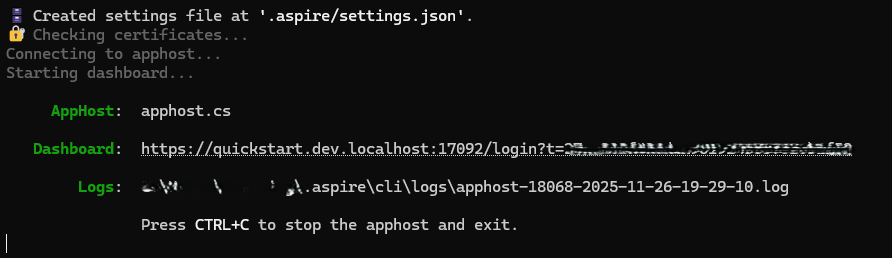
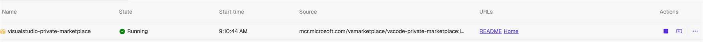
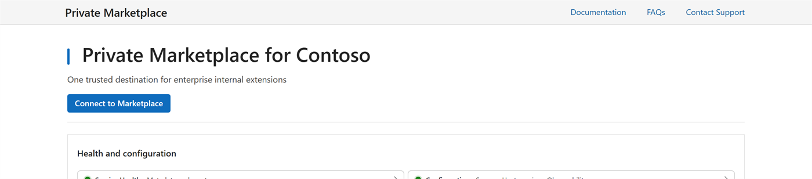
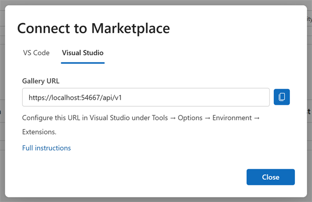
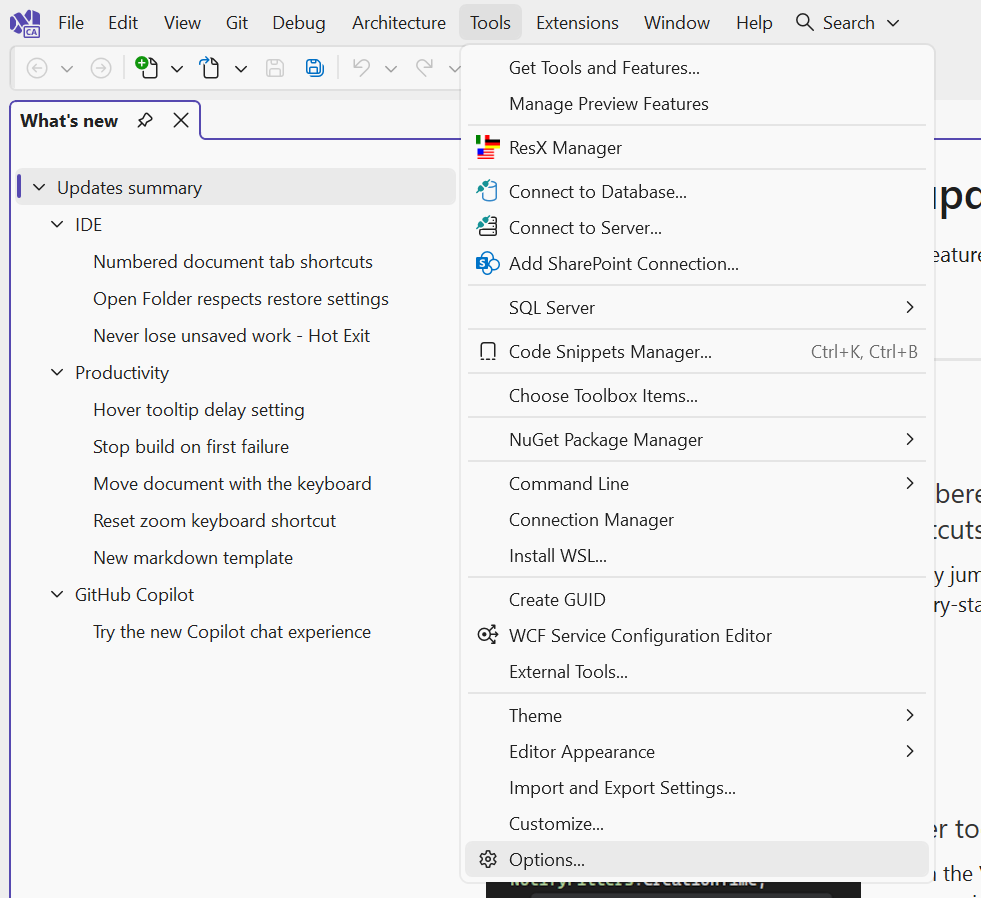
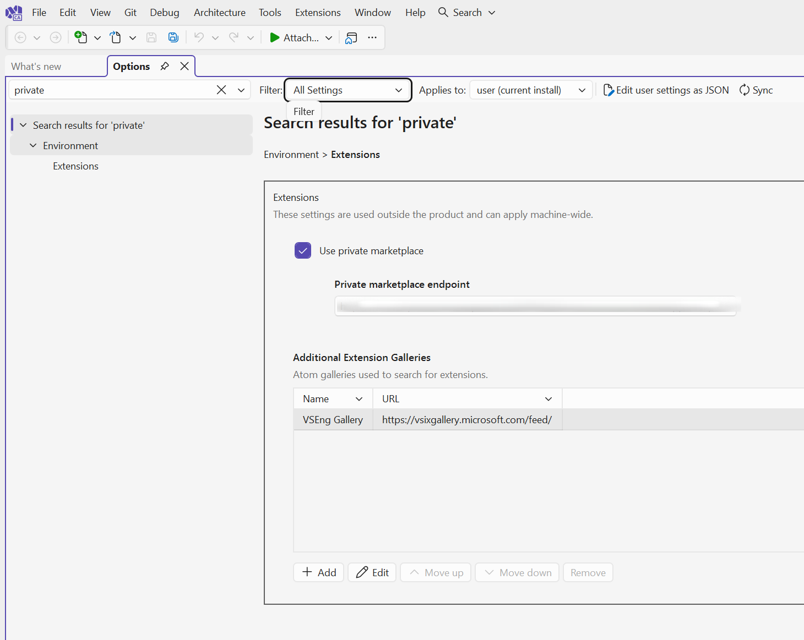
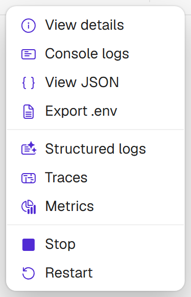

# Private Marketplace for Visual Studio - Quickstart

This quickstart walks you through setting up and testing a local Private Marketplace for Visual Studio using [Aspire](https://aspire.dev) on Windows. You'll learn how to install the marketplace, connect Visual Studio to it, and explore different usage scenarios.

> [!IMPORTANT]
> Visual Studio extension support is a preview feature. This quickstart turns it on for you, and includes sample Visual Studio extensions.

---

## Part 1: Installation

### Prerequisites

Before you begin, ensure you have:
- **Visual Studio 2026 Insiders (18.11 or later)**, already installed. The setup script verifies this but **does not install Visual Studio**. Download it from [Visual Studio 2026 Insiders](https://visualstudio.microsoft.com/insiders/), or update an existing Insiders installation with the Visual Studio Installer.
- **Docker Desktop** installed and running. If it's missing and `winget` is available, the setup script can install it for you after prompting for confirmation.
- **PowerShell 5.1 or later** for running the setup script (Windows PowerShell or PowerShell 7)
- **Internet access** to download the quickstart and its dependencies

By default the quickstart installs its own portable copies of the .NET SDK and the Aspire CLI, so nothing already on the machine is used or altered. The `-UseGlobalInstalls` option changes that - see [Reusing existing installations](#reusing-existing-installations).

#### Visual Studio Detection

The setup script checks for Visual Studio before it does anything else. If a suitable installation is not found, it reports what it found and exits without changing anything:

```text
=== Action Required ===
The following prerequisites must be installed manually before continuing:
  - Visual Studio 18.11 or later
    Current: 18.9.2 installed
    Location: C:\Program Files\Microsoft Visual Studio\18\Enterprise
    Download: https://visualstudio.microsoft.com/insiders/
```

Version 18.11 is a Visual Studio 2026 Insiders build. Install it from [Visual Studio 2026 Insiders](https://visualstudio.microsoft.com/insiders/), or update an existing Insiders installation with the Visual Studio Installer, then run the script again.

Occasionally the script cannot determine which version is installed. When that happens it says so and continues, since a failed check does not mean Visual Studio is missing. Use `-SkipVSVersionCheck` to bypass the version requirement entirely.

### Run the Setup Script

> [!IMPORTANT]
> Never run scripts from untrusted sources, always review the script before running it.
> Always verify the script's hash before executing. The expected hash can be found in the repository or release notes.

The script will automatically:
- Verify Visual Studio 18.11 or later is present - it is never installed for you
- Check for and install missing prerequisites (after prompting for confirmation):
  - Docker Desktop (if not found)
  - Download quickstart files to `$env:TEMP\privatemarketplace-quickstart-vs`
  - Portable .NET SDK 10.0+
  - Portable Aspire CLI version 13+
- Start Docker Desktop if not running
- Launch the Private Marketplace container via Aspire, with Visual Studio extension support enabled

The Quickstart is installed into a temporary folder (`$env:TEMP\privatemarketplace-quickstart-vs`), along with all of the dependencies, except Docker. To remove the Quickstart and all the dependencies, just delete the temporary folder, and uninstall Docker, if desired. The script will attempt to uninstall Docker and remove the temporary folder after Quickstart exits.

The Private Marketplace Quickstart is installed using an installation script available for PowerShell on Windows.

#### Download and install

All commands in this quickstart run in a **PowerShell** terminal. Open one, then run:

```powershell
irm https://raw.githubusercontent.com/microsoft/vsmarketplace/main/privatemarketplace/preview/quickstart/vs/Run-PrivateMarketplace.ps1 | iex
```

Alternatively, you can download the script and run it as a two-step process:

1. Open a PowerShell terminal.

2. Download the script and save it as a file:

   ```powershell
   irm https://raw.githubusercontent.com/microsoft/vsmarketplace/main/privatemarketplace/preview/quickstart/vs/Run-PrivateMarketplace.ps1 -OutFile Run-PrivateMarketplace.ps1
   ```

3. Review the script, then run it to install the required components and the Private Marketplace container:

   ```powershell
   .\Run-PrivateMarketplace.ps1
   ```

> [!NOTE]
> If PowerShell blocks the downloaded script because of your execution policy, run `Unblock-File .\Run-PrivateMarketplace.ps1` and then run it again.

#### Reusing existing installations

By default the quickstart installs its own portable copies of the .NET SDK and the Aspire CLI into the temporary folder, so it never interferes with what you already have installed.

If you would rather reuse tools already on the machine, run the script with `-UseGlobalInstalls`:

```powershell
.\Run-PrivateMarketplace.ps1 -UseGlobalInstalls
```

Each tool is used only when it meets a minimum version:

| Tool | Minimum version |
| --- | --- |
| .NET SDK | 10.0.100 |
| Aspire CLI | 13.0.0 |

Anything missing or too old is still installed locally, so you can mix the two. Docker Desktop is always used from the local machine installation.

### Access the Aspire Dashboard

Once installation completes, the Aspire dashboard will open automatically in your browser. If it doesn't open automatically, look for the dashboard URL in the terminal output and open it manually.



**What is the Aspire Dashboard?**

[Aspire](https://aspire.dev) is a separate Microsoft product for running and observing distributed applications locally. It is not part of the Private Marketplace and is not required to run one - this quickstart simply uses it to start the marketplace container and give you somewhere to watch it. The dashboard it provides offers:
- Real-time status of your marketplace container
- Quick access to the marketplace web interface
- Logs and monitoring information

Anything you do in the dashboard acts on the container Aspire started for this quickstart. When you deploy a Private Marketplace for real, you host the same container image yourself and Aspire is not involved.

In the dashboard, you'll see a resource named **`visualstudio-private-marketplace`** - this is your Private Marketplace container.



---

## Part 2: Connecting Visual Studio

Installation is complete and the marketplace is running. Now point Visual Studio at it.

### Step 1: Get Your Gallery URL

1. In the Aspire dashboard, find the **`visualstudio-private-marketplace`** resource

   

2. In the **URLs** column, click the **Home** link
   - This opens your marketplace's web interface in a new browser tab

   

3. On the marketplace home page, click **Connect to Marketplace**, select the **Visual Studio** tab, and click the copy button next to the **Gallery URL**
   - You'll need this URL in the next step

   

**Tip**: Keep the marketplace home page open in a browser tab - you'll refer to it throughout the quickstart.

### Step 2: Configure Visual Studio

1. Open Visual Studio.
2. Select **Tools → Options**.

   

3. In the search box, type `private`, then select **Environment → Extensions** in the results.
4. Select the **Use private marketplace** checkbox.
5. Paste the Gallery URL you copied into the **Private marketplace endpoint** field.

   

6. Click **OK**.

**What just happened?**
Visual Studio now resolves extensions from your Private Marketplace instead of the public Marketplace.

### Step 3: Browse the Extensions

1. Open **Extensions → Manage Extensions**.
2. The sample Visual Studio extensions from your Private Marketplace appear in the extension list and can be installed.

**Congratulations!** Visual Studio is now connected to your Private Marketplace.

---

## Part 3: Usage Scenarios

Now that you have a working Private Marketplace, try these common scenarios:

### Scenario 1: Adding Extensions to Your Marketplace

The quickstart includes sample extensions, but you'll want to add your own.

1. Open File Explorer and navigate to: `$env:TEMP\privatemarketplace-quickstart-vs\data\extensions`
2. Copy your `.vsix` files into this folder
3. Refresh your marketplace home page in the browser - your new extensions will appear

New `.vsix` files are picked up by the file system source monitor on its refresh interval, so a page refresh is enough and a container restart is not required.

The marketplace inspects each `.vsix` manifest and handles it accordingly, so no separate folder or configuration is needed.

> [!NOTE]
> A Visual Studio extension's manifest must declare asset paths that exist inside the package. An asset path that does not resolve to a file in the `.vsix` is reported in the marketplace log as `Specified part does not exist in the package`, and the extension is not published.

### Scenario 2: Configure Upstreaming to Public Marketplace

Upstreaming is a feature of the Private Marketplace that makes the extensions in the public Marketplace available to clients. Upstreaming has three modes of operation, "None", "Search" and "SearchAndAssets".

By changing the mode the Private Marketplace can support different scenarios
- `None`: No upstreaming. Only private extensions are available.
- `Search`: Only search queries for public extensions are proxied. Asset downloads (VSIX, icons, etc.) are fetched directly from the Public Marketplace by the client.
- `SearchAndAssets`: Both search queries and asset downloads for public extensions are fetched through the Private Marketplace. This mode ensures all Public Visual Studio Marketplace requests go through your Private Marketplace instance, and clients do not contact the Public Visual Studio Marketplace directly.

To change the Upstreaming mode in the Quickstart:

> [!IMPORTANT]
> The upstreaming mode is compiled into the AppHost, so changing it requires restarting the **AppHost**. Stopping and starting the **`visualstudio-private-marketplace`** resource from the Aspire dashboard is not enough - the container's configuration is built when the AppHost starts.

1. Close Visual Studio if it is open
1. In the terminal running Aspire, press `Ctrl+C` to stop the AppHost
1. When prompted to remove the temporary folder, answer **`n`**. Answering `y` deletes the quickstart and all of its dependencies, including the sample extensions and the downloaded prerequisites, and you would have to run the setup script again from the beginning.
1. Open the `$env:TEMP\privatemarketplace-quickstart-vs\apphost.cs` file in an editor
1. Locate the following section:

   ```csharp
   14   builder
   15      .AddVisualStudioPrivateMarketplace()
   16      .WithMarketplaceConfiguration(
   17         organizationName: "Contoso",
   18         contactSupportUri: "mailto:privatemktplace@microsoft.com",
   19         upstreamingMode: MarketplaceUpstreamingMode.SearchAndAssets)
   20      .WithEnvironment("FeatureManagement__VSExtensionSupport", "true");
   ```
1. Change line 19 to:
   ```csharp
         upstreamingMode: MarketplaceUpstreamingMode.None
   ```
1. Save the file
1. Restart the quickstart from a PowerShell terminal:

   ```powershell
   cd $env:TEMP\privatemarketplace-quickstart-vs
   .\Run-PrivateMarketplace.ps1
   ```

   The script detects the existing installation and relaunches Aspire with the rebuilt AppHost.
1. When the Aspire dashboard reopens, click the **Home** link

   You should see upstreaming to the public Marketplace is now disabled.

   

**Verify the change**

1. Open Visual Studio
2. Open **Extensions → Manage Extensions**. Only extensions published through the Private Marketplace are listed and installable.

### Scenario 3: Viewing Marketplace Logs

Monitor what's happening in your marketplace:

1. In the Aspire dashboard, click the **Actions** button (⋮) for **`visualstudio-private-marketplace`**

   

2. Select **Console logs** to see real-time container output
3. Or select **Structured logs** for formatted, searchable logs
4. Use logs to troubleshoot issues or monitor extension requests

### Aspire Tips: Managing the Marketplace Container

Control your marketplace lifecycle:

**Start the Marketplace**
1. Click **Actions** (⋮)
2. Select **Start**
3. Wait for the status to show "Running"

**Stop the Marketplace**
1. In the Aspire dashboard, click **Actions** (⋮)
2. Select **Stop**
3. The marketplace is now offline

**View Detailed Information**
1. Click **Actions** (⋮)
2. Select **View details**
3. See complete resource information, environment variables, and configuration

---

## Part 4: Cleanup

### Restoring Normal Visual Studio Access

When you're done testing, point Visual Studio back at the public Marketplace:

1. In Visual Studio, select **Tools → Options**
2. In the search box, type `private`, then select **Environment → Extensions**
3. Clear the **Use private marketplace** checkbox
4. Click **OK**

### Remove Installation Files

1. In the terminal running Aspire, press `Ctrl+C` to stop it
2. When prompted, choose **Yes (y)** to remove the temporary folder
3. All quickstart files will be deleted from `$env:TEMP\privatemarketplace-quickstart-vs`

### Manual Cleanup

If automatic cleanup fails, run the following in a PowerShell terminal:

```powershell
# Remove temporary folder
Remove-Item -Path "$env:TEMP\privatemarketplace-quickstart-vs" -Recurse -Force
```

---

## Part 5: Troubleshooting

### Visual Studio

**Setup stops with "Visual Studio 18.11 or later" listed under Action Required?**
- Version 18.11 is a Visual Studio 2026 Insiders build. Install it from [Visual Studio 2026 Insiders](https://visualstudio.microsoft.com/insiders/), or update an existing Insiders installation with the Visual Studio Installer, then run the script again
- Build Tools installations are ignored because they have no IDE to host extensions

**Setup reports it could not determine the Visual Studio version?**
- `vswhere.exe` ships with the Visual Studio Installer; if the Installer was removed, detection falls back to the Installer's instance data under `%ProgramData%`
- If neither is readable, the script continues anyway. Confirm your installation is 18.11 or later, or re-run with `-SkipVSVersionCheck`

**Visual Studio not showing your extensions?**
- Confirm **Use private marketplace** is selected under **Tools → Options → Environment → Extensions**
- Confirm the **Private marketplace endpoint** matches the Gallery URL from the marketplace home page
- Restart Visual Studio after changing the setting

### Marketplace Host

**Extensions not appearing?**
- Check that `.vsix` files are in the `data/extensions` folder
- Verify the container is running (check Aspire dashboard)
- Look at the logs in the `data/logs` folder
- Confirm each extension's manifest asset paths resolve to files inside the `.vsix`
