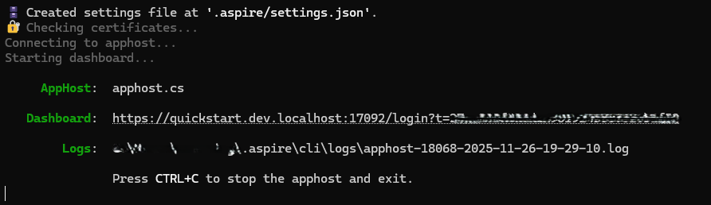
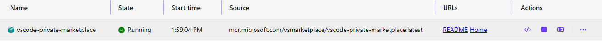
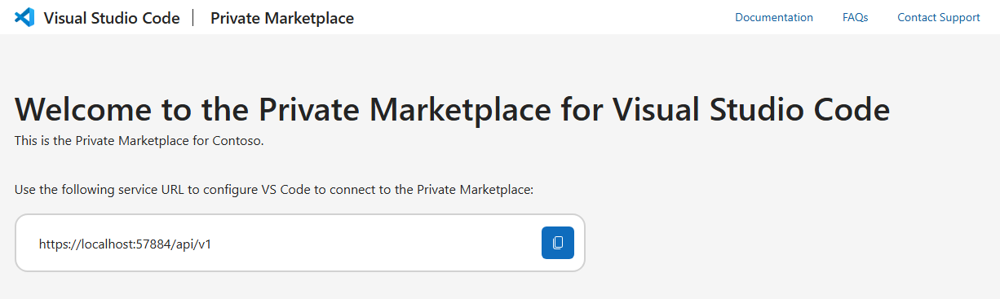
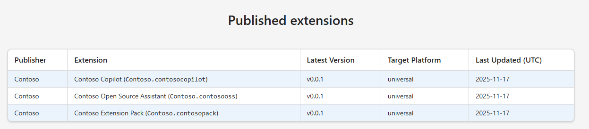
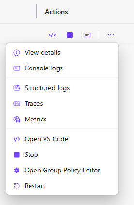
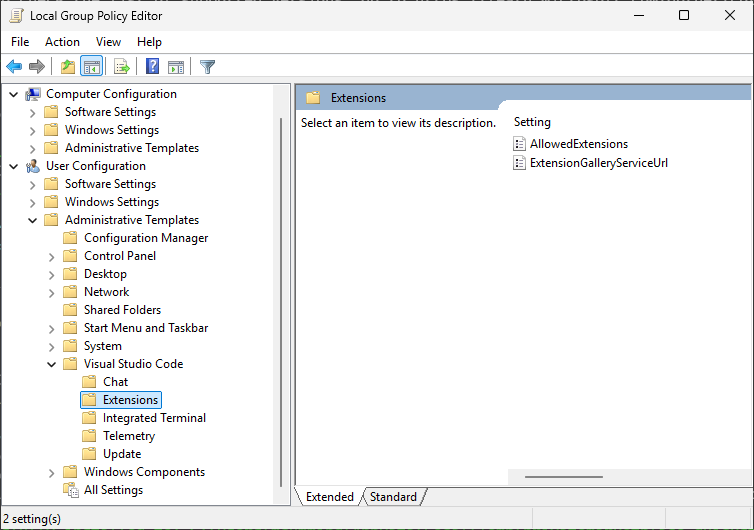
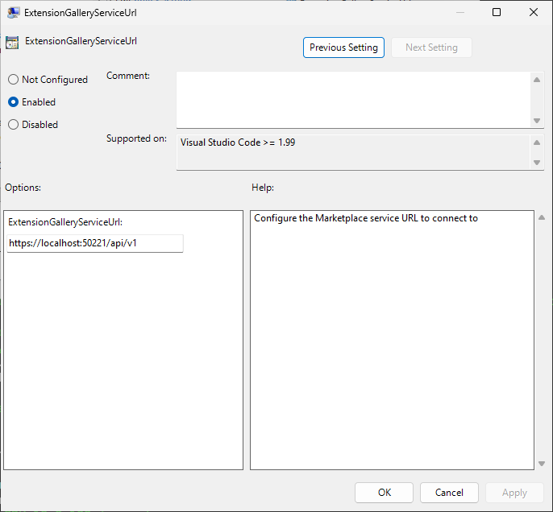
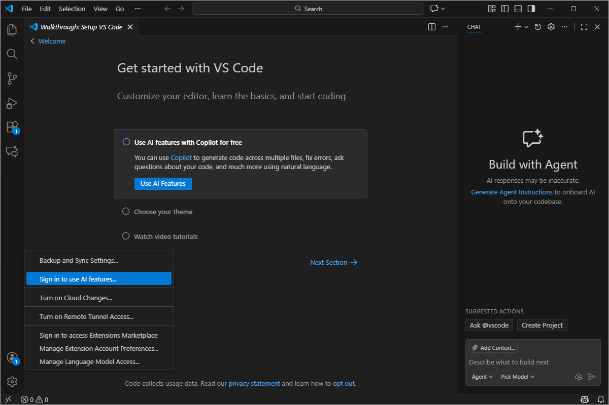
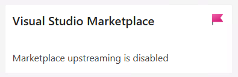

# VS Code Private Marketplace - Quickstart

This quickstart walks you through setting up and testing a local VS Code Private Marketplace using [Aspire](https://aspire.dev) on Windows. You'll learn how to install the marketplace, configure VS Code to use it, and explore different usage scenarios.

---

## Part 1: Installation

### Prerequisites

Before you begin, ensure you have:
- **Docker Desktop** installed and running
- **PowerShell 5.1 or later** for running the setup script

### Run the Setup Script

> [!IMPORTANT]
  Never run scripts from untrusted sources, always review the script before running it.
  Always verify the script's hash before executing. The expected hash can be found in the repository or release notes.

The script will automatically:
- Check for and install missing prerequisites (after prompting for confirmation):
  - Docker Desktop (if not found)
  - Download quickstart files to `$env:TEMP\privatemarketplace-quickstart`
  - Portable VS Code
  - Portable .NET SDK 10.0+
  - Portable Aspire CLI version 13+
- Prompt you to install VS Code Group Policy templates (requires admin privileges - **required for VS Code**)
- Start Docker Desktop if not running
- Launch the Private Marketplace container via Aspire

The Quickstart is installed into a temporary folder ($TEMP\privatemarketplace-quickstart), along with all of the dependencies, except Docker. To remove the Quickstart and all the dependencies, just delete the temporary folder, and uninstall Docker, if desired. The script will attempt to uninstall Docker and remove the temporary folder after Quickstart exits.

The Private Marketplace Quickstart is installed using an installation script available for PowerShell on Windows.

#### Download and install

```powershell
irm https://raw.githubusercontent.com/microsoft/vsmarketplace/main/privatemarketplace/quickstart/aspire/Run-PrivateMarketplace.ps1 | iex
```

Alternatively, you can download the script and run it as a two-step process:

1. Open a terminal.

2. Download the script and save it as a file:

  > irm https://raw.githubusercontent.com/microsoft/vsmarketplace/main/privatemarketplace/quickstart/aspire/Run-PrivateMarketplace.ps1 -OutFile Run-PrivateMarketplace.ps1

3. Run the script to install the required components and the Private Marketplace container.

You should see output similar to the following snippet:
  ```text
  Private Marketplace for VS Code Quickstart
  
    Checking prerequisites...
    Checking for Docker...
    Docker detected: Docker version 29.0.1, build eedd969
    Checking for VS Code...
    VS Code not found
    Checking for Aspire CLI...
    Aspire CLI not found
    Checking for local .NET SDK...
    Local .NET SDK not found
    Checking for quickstart files...
    Folder exists but appears incomplete (apphost.cs not found)
   
    === Missing Prerequisites ===
    - VS Code (portable)
    - Aspire CLI (version 13+)
    - .NET SDK 10.0.100 (local)
    - Quickstart Files
    - VS Code Administrative Templates (requires admin privileges)

    The following will be installed:
    - VS Code (portable): via local portable installation
       Target: C:\Users\mcumming\AppData\Local\Temp\privatemarketplace-quickstart\.vscode
       Source: https://code.visualstudio.com/
    - Aspire CLI (version 13+) (local): via local portable installation
       Target: C:\Users\mcumming\AppData\Local\Temp\privatemarketplace-quickstart\.aspire
       Source: https://learn.microsoft.com/dotnet/aspire
    - .NET SDK 10.0.100+ (local): via dotnet-install script
       Target: C:\Users\mcumming\AppData\Local\Temp\privatemarketplace-quickstart\.dotnet
       Source: https://dotnet.microsoft.com/download/dotnet/10.0
    - Quickstart Files: via ZIP download
       Source: https://github.com/mcumming/vsmarketplace
       Target: C:\Users\mcumming\AppData\Local\Temp\privatemarketplace-quickstart
    - VS Code Administrative Templates: via elevated script execution
       Note: Requires administrator privileges (UAC prompt)
   
    Do you want to proceed with installation? (y/n):
  ```

### Access the Aspire Dashboard

Once installation completes, the Aspire dashboard will open automatically in your browser. If it doesn't open automatically, look for the dashboard URL in the terminal output and open it manually.



**What is the Aspire Dashboard?**
The Aspire dashboard is your control center for managing the Private Marketplace. It provides:
- Real-time status of your marketplace container
- Quick access to the marketplace web interface
- Commands to launch VS Code and configure settings
- Logs and monitoring information

In the dashboard, you'll see a resource named **`vscode-private-marketplace`** - this is your Private Marketplace container.



---

## Part 2: Configuring VS Code

Now let's configure VS Code to use your Private Marketplace instead of the public VS Code Marketplace.

### Step 1: Get Your Marketplace URL

1. In the Aspire dashboard, find the **`vscode-private-marketplace`** resource

   

2. In the **URLs** column, click the **Home** link
   - This opens your marketplace's web interface in a new browser tab
3. On the marketplace home page, you'll see the Private Marketplace URL at the top with a copy icon, and the Published Extensions section below

   

4. Click the **copy icon** (blue button on the right) next to the marketplace URL to copy it to your clipboard
   - You'll need this URL in the next step

The quickstart includes three sample extensions preloaded in the marketplace:



**Tip**: Keep the marketplace home page open in a browser tab - you'll refer to it throughout the quickstart.

### Step 2: Configure Group Policy

1. Return to the Aspire dashboard browser tab
2. Locate the **`vscode-private-marketplace`** resource
3. Click the **Actions** button (three vertical dots ⋮) on the right side of the resource row
   
   

4. From the Actions menu, select **Open Group Policy Editor**

> [!NOTE]
  If this option doesn't appear, see the [Troubleshooting](#troubleshooting) section below

5. In the Group Policy Editor window that opens, navigate to the Extensions folder:   
 
> [!NOTE]
  The Group Policy Editor window might not open in the foreground, look in the taskbar for the application.

   

   - Navigate to: **User Configuration → Administrative Templates → Visual Studio Code → Extensions**
   - Double-click **Extension Gallery Service URL**
   - In the settings window, select **Enabled**
   - **Paste** the marketplace URL you copied earlier into the **ExtensionGalleryServiceUrl** field
   
   

   - Click **OK**
6. Close the Group Policy Editor

**What just happened?**
You configured Windows Group Policy to redirect VS Code's extension marketplace to your private instance. VS Code will now only show extensions from your Private Marketplace.

### Step 3: Launch VS Code

1. Return to the Aspire dashboard
2. Click the **Actions** button (⋮) for the **`vscode-private-marketplace`** resource

   

3. Select **Open VS Code** from the menu
   - This launches the portable VS Code instance configured to use your Private Marketplace
4. Once VS Code opens, **sign in to GitHub**:
   - Click the **Accounts** icon in the lower-left corner (or the profile icon)
   - Select **Sign in to access Extensions Marketplace...**

   

   - Complete the authentication process in your browser
   
> [!IMPORTANT]
  You must sign in to GitHub before extensions will be available

5. After signing in, click the Extensions icon in the sidebar (or press `Ctrl+Shift+X`)
6. You'll see the sample extensions from your Private Marketplace listed first, followed by public extensions.

**Congratulations!** VS Code is now connected to your Private Marketplace.

---

## Part 3: Usage Scenarios

Now that you have a working Private Marketplace, try these common scenarios:

### Scenario 1: Adding Extensions to Your Marketplace

The quickstart includes sample extensions, but you'll want to add your own, or rehost extensions from the public Marketplace

**Download VSIX Files**

To download extension VSIX files from the public Marketplace for rehosting:

1. Open VS Code (any instance connected to the public marketplace)
2. Press `Ctrl+Shift+X` to open Extensions
3. Find the extension you want
4. Right-click the extension → **Download VSIX**
5. Select the location to save the downloaded `.vsix` file to

**Add Extensions to the Marketplace**

1. Open File Explorer and navigate to: `$env:TEMP\privatemarketplace-quickstart\data\extensions`
2. Copy your `.vsix` files into this folder
5. Refresh your marketplace home page in the browser - your new extensions will appear!
6. In VS Code, reload the Extensions view to see the new extensions

### Scenario 2: Restricting Extensions to Specific Publishers

You can configure VS Code to only allow extensions from specific publishers, such as your organization's internal publisher.

**Configure Allowed Extensions Policy**

1. In the Aspire dashboard, click **Actions** (⋮) for **`vscode-private-marketplace`**
2. Select **Open Group Policy Editor**
3. Navigate to: **User Configuration → Administrative Templates → Visual Studio Code → Extensions**
4. Double-click **Allowed Extensions**
5. Select **Enabled**
6. In the **AllowedExtensions** field, enter the following JSON to allow only Contoso extensions:
   ```json
   {"Contoso": true}
   ```
7. Click **OK** and close the Group Policy Editor
8. Restart VS Code (close and reopen using the **Open VS Code** command in the Aspire dashboard)
9. In the Extensions view, only extensions from the Contoso publisher can be installed.

**What just happened?**
The `AllowedExtensions` policy controls which extensions can be installed. By setting `"Contoso": true`, you've restricted VS Code to only allow installation of extensions published by Contoso. All other publishers are blocked. See the [VS Code Documentation](https://code.visualstudio.com/docs/setup/enterprise#_configure-allowed-extensions) for more ways to configure the Allowed Extensions setting.

**Other Allowed Extensions Examples:**

To allow multiple publishers:
```json
{"Contoso": true, "microsoft": true}
```

To allow specific extensions only:
```json
{"Contoso.contosocopilot": true, "Contoso.contosooss": true}
```

To block a specific extension from an allowed publisher:
```json
{"Contoso": true, "Contoso.contosopack": false}
```

**Restore Default (Allow All Extensions):**
1. Return to the **Allowed Extensions** policy in Group Policy Editor
2. Select **Not Configured**
3. Click **OK**
4. Restart VS Code

### Scenario 3: Configure Upstreaming to Public Marketplace

Upstreaming is a feature of the Private Marketplace that makes the extensions in the public Marketplace available to VS Code clients. Upstreaming has three modes of operation, "None", "Search" and "SearchAndAssets". 

By changing the mode the Private Marketplace can support different scenarios
- `None`: No upstreaming. Only private extensions are available.
- `Search`: Only search queries for public extensions are proxied. Asset downloads (VSIX, icons, etc.) are fetched directly from the Public Marketplace by VS Code.
- `SearchAndAssets`: Both search queries and asset downloads for public extensions are fetched through the Private Marketplace. This mode ensures all Public Visual Studio Marketplace requests go through your Private Marketplace instance, and clients do not contact the Public Visual Studio Marketplace directly.
 

To change the Upstreaming mode in the Quickstart:
1. In the Aspire dashboard, click the **Actions** button (⋮) for **`vscode-private-marketplace`**

   

1. Select **Stop** from the menu
1. Close VS Code if it is open
1. Open the `$env:TEMP\privatemarketplace-quickstart\AppHost.cs` file in an editor such as VS Code.
1. Locate the following section:

   ```csharp
   14   builder
   15      .AddVSCodePrivateMarketplace("vscode-private-marketplace")
   16      .WithMarketplaceConfiguration(
   17         organizationName: "Contoso",
   18         contactSupportUri: "mailto:privatemktplace@microsoft.com",
   19         upstreamingMode: MarketplaceUpstreamingMode.SearchAndAssets)
   20      .WithOpenGroupPolicyEditorCommand()
   21      .WithOpenVSCodeCommand();
   ```
1. Change line 19 to:
   ```csharp
         upstreamingMode: MarketplaceUpstreamingMode.None
   ```
1. Back in the Aspire dashboard, click the **Home** link
   
   You should see upstreaming to the public Marketplace is now disabled.

   

1. Back in the Aspire dashboard, click the **Actions** button (⋮) for **`vscode-private-marketplace`**

   

1. Select **Start** from the menu
1. Open VS Code from the Actions menu
1. In the Extensions view, only extensions published through the Private Marketplace are listed and installable.

### Scenario 4: Viewing Marketplace Logs

Monitor what's happening in your marketplace:

1. In the Aspire dashboard, click the **Actions** button (⋮) for **`vscode-private-marketplace`**
2. Select **Console logs** to see real-time container output
3. Or select **Structured logs** for formatted, searchable logs
4. Use logs to troubleshoot issues or monitor extension requests

### Aspire Tips: Managing the Marketplace Container

Control your marketplace lifecycle:

**Start the Marketplace**
1. Click **Actions** (⋮)
2. Select **Start**
3. Wait for the status to show "Running"

**Stop the Marketplace**
1. In the Aspire dashboard, click **Actions** (⋮)
2. Select **Stop**
3. The marketplace is now offline

**View Detailed Information**
1. Click **Actions** (⋮)
2. Select **View details**
3. See complete resource information, environment variables, and configuration

---

## Part 4: Cleanup

### Restoring Normal VS Code Access

When you're done testing, restore VS Code to use the public marketplace:

1. In the Aspire dashboard, click **Actions** (⋮) for **`vscode-private-marketplace`**
2. Select **Open Group Policy Editor**
3. Navigate to: **User Configuration → Administrative Templates → Visual Studio Code → Extensions**
4. Double-click **Extension Gallery Service URL**
5. Select **Not Configured**
6. Click **OK** and close the Group Policy Editor
7. Restart VS Code to reconnect to the public marketplace

### Remove Installation Files

1. In your terminal, press `Ctrl+C` to stop Aspire
2. When prompted, choose **Yes (y)** to remove the temporary folder
3. All quickstart files will be deleted from `$env:TEMP\privatemarketplace-quickstart`

**Optional: Remove Administrative Templates**

If you want to completely remove the Group Policy templates:

1. Open PowerShell as Administrator
2. Run:
   ```powershell
   Remove-Item -Path "$env:WINDIR\PolicyDefinitions\VSCode.admx" -Force
   Get-ChildItem -Path "$env:WINDIR\PolicyDefinitions" -Directory | ForEach-Object {
       $admlFile = Join-Path $_.FullName "VSCode.adml"
       if (Test-Path $admlFile) {
           Remove-Item -Path $admlFile -Force
       }
   }
   ```

### Manual Cleanup

If automatic cleanup fails:

```powershell
# Remove temporary folder
Remove-Item -Path "$env:TEMP\privatemarketplace-quickstart" -Recurse -Force

# Remove Group Policy setting
# Open Group Policy Editor (gpedit.msc) and set:
# User Configuration → Administrative Templates → Visual Studio Code → Extensions
# → Extension Gallery Service URL → Not Configured
```

---

## Part 5: Troubleshooting

**Group Policy Editor command not appearing?**

If you skipped the administrative templates installation during setup, or they failed to install, you can install them manually:

1. In the Aspire dashboard, click **Actions** (⋮) for **`vscode-private-marketplace`**
2. Select **Stop** to stop the marketplace container
3. Open PowerShell as Administrator (right-click → Run as Administrator)
4. Navigate to the temporary installation folder:
   ```powershell
   cd $env:TEMP\privatemarketplace-quickstart
   ```
5. Run the script with the install templates parameter:
   ```powershell
   .\Run-PrivateMarketplace.ps1 -InstallAdminTemplates
   ```
6. Return to the Aspire dashboard
7. Click **Actions** (⋮) for **`vscode-private-marketplace`**
8. Select **Start** to start the marketplace container

The Group Policy Editor command should now appear in the Aspire dashboard Actions menu.

**VS Code not connecting to Private Marketplace?**
- Verify the Group Policy setting is enabled and contains the correct URL
- Restart VS Code after changing the policy

**Extensions not appearing?**
- Check that `.vsix` files are in the `data/extensions` folder
- Verify the container is running (check Aspire dashboard)
- Look at the logs in the `data/logs` folder
