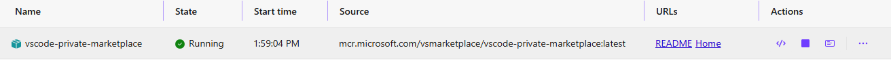
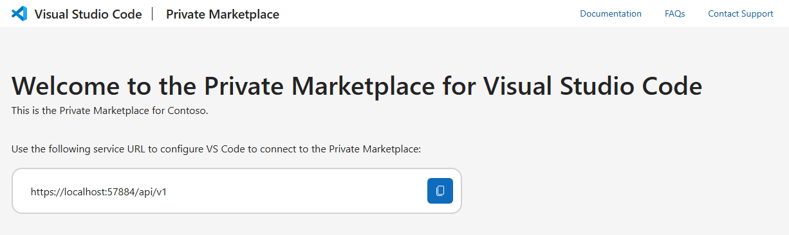
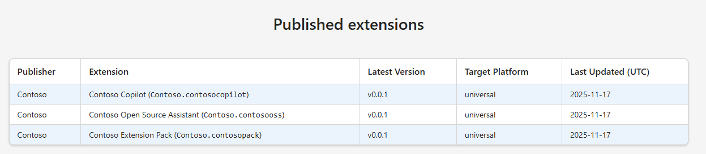
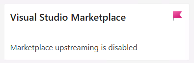
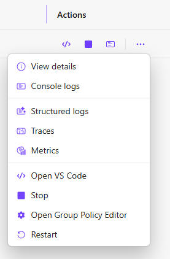
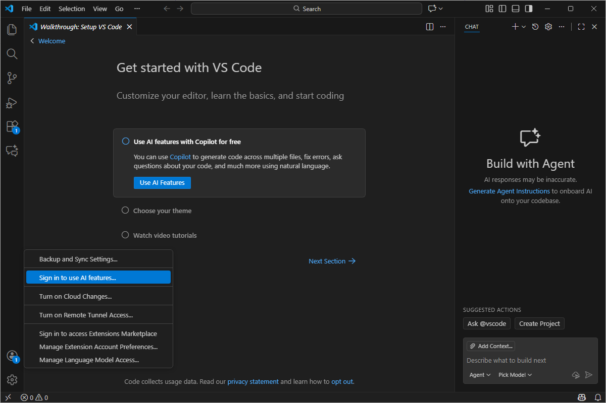
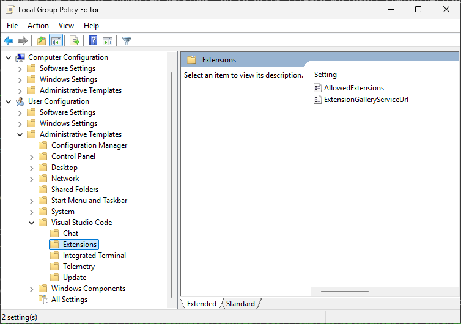
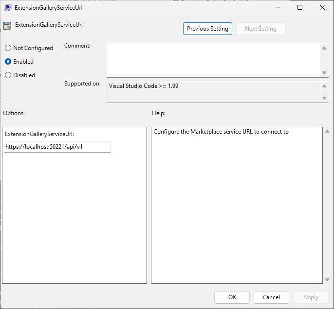

# Private Marketplace for Visual Studio - Aspire Quickstart

This quickstart is for administrators managing the Visual Studio family of products. It deploys a local Private Marketplace for Visual Studio on Windows using [Aspire](https://aspire.dev). Hosting and verification are client-neutral, but connection and organizational rollout are client-specific. Follow only the section for the client you manage:

- [Visual Studio Code](#2-connect-visual-studio-code) includes working connection instructions.
- [Visual Studio 2026](#3-connect-visual-studio-2026-coming-soon) connection instructions are coming soon and do not reuse the Visual Studio Code connection or policy model.

## 1. Deploy and host the Private Marketplace

### Prerequisites

Before you begin, ensure you have:

- **Docker Desktop** installed and running.
- **PowerShell 5.1 or later** to run the setup script.

The setup script also installs a portable VS Code instance and local .NET and Aspire dependencies for the quickstart. The VS Code installation is only used by the optional VS Code connection walkthrough; it is not required to host or verify the marketplace.

> [!IMPORTANT]
> Never run scripts from untrusted sources. Review the script before running it and verify its hash against a trusted source.

### Download and run the setup script

Download the script, review it, and then run it:

```powershell
irm https://raw.githubusercontent.com/microsoft/vsmarketplace/main/privatemarketplace/quickstart/aspire/Run-PrivateMarketplace.ps1 -OutFile Run-PrivateMarketplace.ps1
.\Run-PrivateMarketplace.ps1
```

The script downloads the quickstart to `$env:TEMP\privatemarketplace-quickstart`, starts Docker Desktop if necessary, and launches the Private Marketplace container through Aspire.

The script may offer to install VS Code administrative templates. **This is optional.** Select `n` to skip it when you are only hosting, verifying, or using the quickstart's direct VS Code launch. You can install the templates later if you want to use Windows Group Policy for a centralized rollout.

### Verify the hosted marketplace

When setup completes, Aspire opens its dashboard in a browser. If it does not, open the dashboard URL printed in the terminal.


In the dashboard:

1. Confirm that the **`vscode-private-marketplace`** resource is running.
2. In its **URLs** column, select **Home**.
3. Confirm that the marketplace home page opens and displays its URL and the sample extensions.





The quickstart includes three sample extensions:



These steps verify that the marketplace is deployed and serving extensions. They do not require a particular client configuration.

### Add or update hosted extensions

To obtain a VSIX from the public Marketplace for rehosting:

1. Open a VS Code instance connected to the public Marketplace.
2. Open **Extensions** (`Ctrl+Shift+X`) and find the extension.
3. Right-click the extension and select **Download VSIX**.
4. Choose where to save the `.vsix` file.

Place `.vsix` files in:

```text
$env:TEMP\privatemarketplace-quickstart\data\extensions
```

The container reads this directory at startup. In the Aspire dashboard, stop and restart **`vscode-private-marketplace`**, then refresh the marketplace home page and confirm the extensions appear. See the [extensions directory README](data/extensions/README.md) for the directory behavior.

### Configure upstreaming

Upstreaming controls whether the marketplace makes extensions from the public Visual Studio Marketplace available in addition to the extensions you host. The quickstart supports:

- `None`: Only privately hosted extensions are available.
- `Search`: Public-extension searches are proxied; assets are retrieved from the public marketplace.
- `SearchAndAssets`: Public-extension searches and assets are served through the Private Marketplace.

To change the mode:

1. In the Aspire dashboard, select **Actions** (⋮) for **`vscode-private-marketplace`**, then select **Stop**.
2. Open `$env:TEMP\privatemarketplace-quickstart\AppHost.cs`.
3. Change `upstreamingMode` in the marketplace configuration. For example, to expose only privately hosted extensions:

   ```csharp
   upstreamingMode: MarketplaceUpstreamingMode.None
   ```

4. Start the resource again from the Aspire dashboard.
5. Select **Home** and confirm the page reflects the selected mode.



### Monitor and manage the host

Use **Actions** (⋮) for **`vscode-private-marketplace`** in the Aspire dashboard to:

- Start or stop the marketplace.
- Open **Console logs** or **Structured logs**.
- View resource details, including environment variables and health information.

## 2. Connect Visual Studio Code

The quickstart provides a working VS Code connection path without Group Policy:

1. In the Aspire dashboard, select **Actions** (⋮) for **`vscode-private-marketplace`**.

   

2. Select **Open VS Code**. This opens the portable, isolated VS Code instance configured to use the running Private Marketplace.
3. In VS Code, sign in to GitHub:
   1. Select the **Accounts** icon in the lower-left corner.
   2. Select **Sign in to access Extensions Marketplace...**.
   3. Complete authentication in the browser.

   

4. Open **Extensions** (`Ctrl+Shift+X`) and confirm the sample extensions are available. When upstreaming is enabled, public extensions are also available according to the configured mode.

> [!IMPORTANT]
> Sign in to GitHub before browsing or installing extensions.

## 3. Connect Visual Studio 2026 (coming soon)

Visual Studio 2026 client connection guidance is coming soon. Do not apply the Visual Studio Code instructions, policies, or assumptions in this quickstart to Visual Studio 2026.

## 4. Optional Visual Studio Code organizational governance and rollout

This section is for administrators who want to configure or enforce Visual Studio Code behavior across an organization. It does not apply to Visual Studio 2026 and is not required to deploy, host, verify, or try the Private Marketplace with the quickstart's **Open VS Code** action.

### Roll out the marketplace with Windows Group Policy

Windows Group Policy can configure VS Code clients to use the hosted marketplace.

If the VS Code administrative templates are not installed, run the following command from an elevated PowerShell prompt in the quickstart folder:

```powershell
.\Run-PrivateMarketplace.ps1 -InstallAdminTemplates
```

Then configure the policy:

1. In the Aspire dashboard, select **Actions** (⋮) for **`vscode-private-marketplace`**, then select **Open Group Policy Editor**.
2. Navigate to **User Configuration → Administrative Templates → Visual Studio Code → Extensions**.
3. Open **Extension Gallery Service URL**, select **Enabled**, and paste the marketplace URL from the **Home** page into **ExtensionGalleryServiceUrl**.
4. Select **OK**, then restart VS Code.





The dashboard only shows **Open Group Policy Editor** when the administrative templates are installed.

### Restrict allowed extensions

Use the optional **Allowed Extensions** policy to limit what VS Code users can install:

1. In Group Policy Editor, navigate to **User Configuration → Administrative Templates → Visual Studio Code → Extensions**.
2. Open **Allowed Extensions**, select **Enabled**, and enter an allowlist. For example, to allow only the Contoso publisher:

   ```json
   {"Contoso": true}
   ```

3. Select **OK** and restart VS Code.

Additional examples:

```json
{"Contoso": true, "microsoft": true}
```

```json
{"Contoso.contosocopilot": true, "Contoso.contosooss": true}
```

```json
{"Contoso": true, "Contoso.contosopack": false}
```

To remove the restriction, set **Allowed Extensions** to **Not Configured** and restart VS Code. For more options, see the [VS Code enterprise documentation](https://code.visualstudio.com/docs/setup/enterprise#_configure-allowed-extensions).

### Remove optional policy configuration

To return policy-managed VS Code clients to their normal marketplace configuration:

1. In Group Policy Editor, set **Extension Gallery Service URL** to **Not Configured**.
2. Restart VS Code.

If you installed the quickstart's administrative templates and no longer need them, run the following command from an elevated PowerShell prompt:

```powershell
.\Run-PrivateMarketplace.ps1 -RemoveAdminTemplates
```

## 5. Cleanup and troubleshooting

Press `Ctrl+C` in the terminal running Aspire to stop the quickstart. When prompted, choose `y` to remove `$env:TEMP\privatemarketplace-quickstart`. If the setup script installed Docker Desktop, it also offers to uninstall it.

If automatic cleanup cannot remove the temporary folder, close programs using it and then run:

```powershell
Remove-Item -Path "$env:TEMP\privatemarketplace-quickstart" -Recurse -Force
```

If extensions do not appear on the marketplace home page:

- Confirm that `.vsix` files are in `data\extensions`.
- Confirm that **`vscode-private-marketplace`** is running in the Aspire dashboard.
- Review the container logs from the dashboard or the files in `data\logs`.

If policy-managed VS Code is not connecting, confirm that **Extension Gallery Service URL** is enabled with the current marketplace URL, then restart VS Code.
